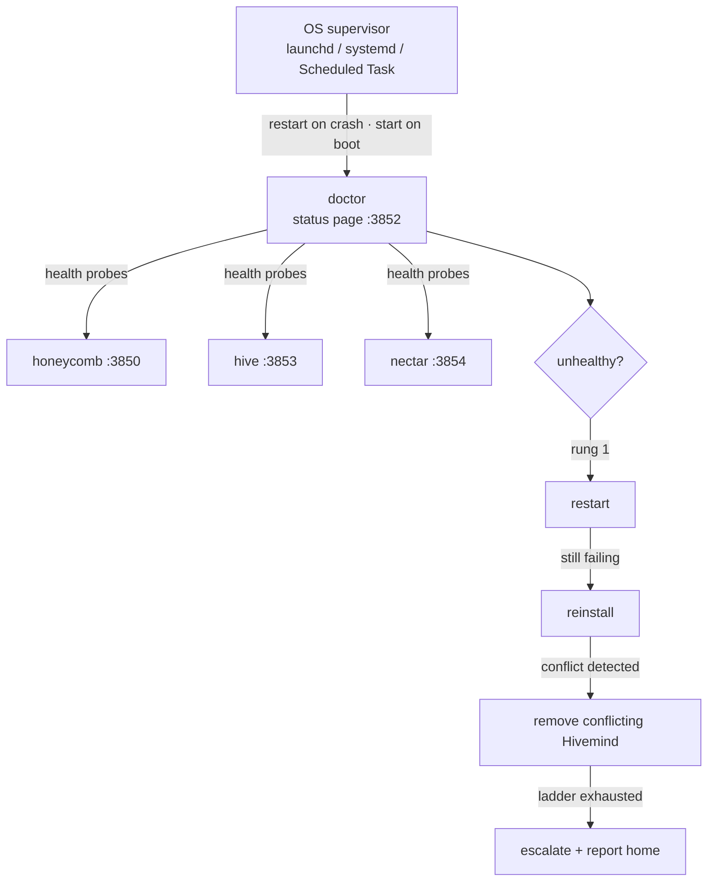

<!-- ───────────────────────────────  HERO  ─────────────────────────────── -->

<p align="center">
  <picture>
    <source media="(prefers-color-scheme: dark)" srcset="assets/brand/doctor-wordmark-on-dark.svg">
    
  </picture>
</p>

<h1 align="center">Doctor</h1>

<p align="center">
  <strong>The watchdog that keeps your agents' brain alive.</strong><br>
  A daemon you cannot see is a daemon you cannot trust.
</p>

<p align="center">
  <a href="https://www.npmjs.com/package/@legioncodeinc/doctor"></a>
  
  
</p>

<p align="center">
  <a href="https://linktr.ee/marioaldayuz"></a>
  <a href="https://www.legioncodeinc.com"></a>
  <a href="https://deeplake.ai"></a>
</p>

<p align="center">
  <a href="https://github.com/legioncodeinc/doctor"></a>
  <a href="https://discord.gg/GX95YTQypQ"></a>
</p>

<!-- ──────────────────────────────  PARTNERS  ────────────────────────────── -->

<p align="center">
  <a href="https://github.com/legioncodeinc">
    <picture>
      <source media="(prefers-color-scheme: dark)" srcset="assets/brand/legion-logo-dark.svg">
      
    </picture>
  </a>
  &nbsp;&nbsp;&nbsp;&nbsp;&nbsp;&nbsp;
  <a href="https://github.com/activeloopai">
    <picture>
      <source media="(prefers-color-scheme: dark)" srcset="assets/brand/activeloop-full-mark-logo-on-dark.svg">
      
    </picture>
  </a>
</p>

<p align="center"><em>A <a href="https://github.com/legioncodeinc">Legion Code Inc.</a> × <a href="https://github.com/activeloopai">Activeloop</a> collaboration.</em></p>


Your memory daemon died at 2am and nothing noticed. You found out the next morning, one session in, when your agent had the memory of a goldfish and you burned twenty minutes re-explaining a codebase it knew yesterday. That failure mode is the whole reason Doctor exists.

Doctor is a deliberately tiny, self-healing watchdog and fleet supervisor for [The Apiary](https://theapiary.sh) stack. Zero runtime dependencies, Node built-ins only, built to be harder to kill than anything it watches. It answers the questions you should never have to ask:

- **Is the stack healthy right now?** Probe every daemon, know per-subsystem what is wrong, not just that something is.
- **Who restarts the restarter?** Your OS does. Doctor is supervised by launchd, systemd, or a Windows Scheduled Task, so it survives crashes and reboots independently of the daemons it watches.
- **How do updates happen without breaking a working install?** Behind a blessed-release gate, verified, and rolled back on failure. A bad release cannot auto-propagate.


> **New here?** One command and you're on a dashboard. [Jump to Install](#-install-one-command). · **Want the docs?** Everything lives at **[theapiary.sh](https://theapiary.sh)**.


<table>
<tr>
<td width="50%" valign="top">

#### 🛹 For AI Augmented Devs
Install once, never babysit a daemon again. Doctor probes health on a fixed interval, fixes the common failures the way a careful operator would, and goes quiet the moment things are green. You stop being your own on-call.

</td>
<td width="50%" valign="top">

#### 🏢 For Enterprise Teams
Fleet-wide health for every daemon in the stack from one authoritative source of truth. Scrubbed, proactive diagnostics when a machine cannot heal itself, so support stops being guesswork. Auto-updates that are auditable and gated behind a blessed release, never a surprise.

</td>
</tr>
</table>


## ✨ What makes Doctor different

Most watchdogs are either a cron job with delusions or a monitoring platform that needs its own monitoring. Doctor picked a harder lane:

- **Zero runtime dependencies.** Node built-ins only. There is no supply chain to compromise and no dependency that can take the watchdog down with it.
- **OS-supervised, not self-supervised.** launchd / systemd / Windows Scheduled Task restart it on crash and start it on boot. It never depends on the daemons it watches to stay alive, and they never depend on it.
- **An escalating repair ladder, not a blind restart loop.** It climbs restart, reinstall, remove-conflict, escalate, with exponential backoff between rungs, and stops the instant health returns.
- **Silent when healthy.** A green probe is a debug line. An unhealable install is a high-signal escalation. Nothing in between wastes your attention.
- **Never touches your credentials.** If it suspects a credential fault, it escalates instead of touching them. Full stop.


## 🩺 Features

- **🔍 Watches and heals.** Probes each daemon's `/health` on a fixed interval, reads per-subsystem detail, and repairs what it can without waking you up.
- **🪜 Repair ladder with backoff.** Restart, then reinstall, then remove a conflicting `@deeplake/hivemind` global (the package only, never your `~/.deeplake/` data), then escalate. Exponential backoff between rungs; stops the moment health returns.
- **🐝 Multi-daemon registry.** Supervises the whole fleet from a static registry at `~/.honeycomb/doctor.daemons.json`: honeycomb, hive, and nectar. A daemon that is down is still supervised, because "should exist" survives independently of "is running."
- **📟 Status endpoint on `:3852`.** A loopback status page plus machine-readable `/status.json`, so you can see the whole fleet's health in one place.
- **⬆️ Blessed-release auto-update with rollback.** Keeps daemons current behind a blessed-version gate: verify health after the update, roll back on failure.
- **📣 Opt-out scrubbed telemetry.** When it genuinely cannot heal, it phones home a scrubbed diagnosis so problems get fixed proactively. Never credentials, tokens, or your code. Opt out with `DO_NOT_TRACK=1`, `HONEYCOMB_TELEMETRY=0`, or the dashboard.


## 🚀 Install (one command)

You almost never install Doctor by hand. The Apiary stack installer sets it up and registers its OS service automatically (opt out with `--no-doctor`):

```bash
# macOS / Linux
curl -fsSL https://get.theapiary.sh | sh
```

```powershell
# Windows (PowerShell)
irm https://get.theapiary.sh/install.ps1 | iex
```

To install or update it on its own:

```bash
npm install -g @legioncodeinc/doctor
doctor install-service   # register the OS service (restart-on-crash, start-on-boot)
```

<details>
<summary><strong>Prefer to build from source?</strong></summary>

```bash
git clone https://github.com/legioncodeinc/doctor.git
cd doctor
npm install            # dev deps only; the shipped package has zero runtime deps
npm run typecheck
npm run test
npm run build          # tsc + esbuild -> the single-file bin at bundle/cli.js
```

`npm run ci` runs the typecheck + test gate. `npm run pack:check` verifies the publish payload before a cut.

</details>


## 🎛️ Using the dashboard

<!-- screenshot pending: drop doctor status page capture into assets/screenshots/dashboard.png -->


The dashboard is **Hive portal at `http://127.0.0.1:3853`**: fleet health lives there, rendered from the data Doctor feeds it. Behind it, Doctor serves its own raw status surface on loopback at **`http://127.0.0.1:3852`**, the authoritative source of truth: every registered daemon's state (`ok`, `degraded`, `unreachable`, or `unknown`), what Doctor last did about it, and whether anything needs your attention. The same data is machine-readable at **`/status.json`**. When something is unhealable, the "needs attention" report surfaces here first, on your machine, before anything leaves it.


## ⌨️ Using the CLI

Run `doctor` with no arguments for the banner and menu. The full surface:

| Command | What it does |
|---|---|
| `doctor status` | daemon health, service state, versions, last heal, opt-out flags |
| `doctor diagnose` | classify health and print the recommended fix, taking **no** action |
| `doctor heal` | run the remediation ladder once (gated steps confirm first) |
| `doctor restart` | restart the primary daemon (rung 1) |
| `doctor reinstall` | reinstall the primary daemon (rung 2) |
| `doctor uninstall-hivemind` | remove a conflicting `@deeplake/hivemind` global (rung 3, confirms) |
| `doctor update [--check]` | update the primary daemon via the blessed gate |
| `doctor self-update` | update Doctor's own package (the **only** thing that does) |
| `doctor install-service` / `uninstall-service` | register or remove the OS service |
| `doctor logs` | tail incident logs for all daemons, or one via `--daemon <name>` |

Doctor never updates itself in the background. `self-update` is the single, explicit way to bump it, and there is deliberately no `clear-credentials` command: credential purges are only ever recommended via escalation, never automated.


## 🔫 Kill it. Watch it come back.

Do not take our word for it. Shoot the daemon and watch:

```bash
# Kill the honeycomb daemon on purpose…
pkill -f honeycomb

# …give the doctor one probe interval, then check
doctor status
# honeycomb    ok    healed 12s ago (rung 1: restart)
```

That is the whole pitch: the failure happened, the fix happened, and you were never on the hook for either.


## 🏗️ How it works

The OS supervises the doctor; the doctor supervises everything else. Health flows in through probes, repairs flow out through the ladder, and nothing shares a failure domain with what it watches.



Per-daemon supervision knobs (probe interval, startup grace, restart give-up threshold, cooldown) live in the registry, and every probe URL is pinned to loopback as defense in depth. Repairs back off exponentially and stop the instant health returns.


## 🤝 Why this matters

A daemon you cannot see is a daemon you cannot trust. Your agents' memory is infrastructure now, and the difference between a demo and infrastructure is not the happy path. It is what happens when it breaks at 2am with nobody watching.

Trust is not a feeling here, it is a mechanism. You trust the stack because something dumber, smaller, and tougher than the stack is standing watch over it, because that something is restarted by your operating system rather than by hope, and because when it fails to heal a machine it says so loudly instead of quietly rotting. Doctor is built to be boring in exactly the way load-bearing things should be boring.

And when it truly cannot fix something, it does not shrug. It writes a structured report, surfaces it on the local status page, and (unless you opt out) sends the scrubbed diagnosis to the maintainers, so the fix ships before the support thread starts.


## 🔌 Other interfaces

- **Status page.** `http://127.0.0.1:3852` on loopback, human-readable fleet health at a glance.
- **`GET /status.json`.** The same fleet model as JSON, for scripts and anything else that wants machine-readable truth.
- **SSE telemetry feed.** Doctor is the single source of truth for fleet health and telemetry: it polls each service's local SQLite telemetry (read-only, via Node's built-in `node:sqlite`) plus `/health`, merges the results, and streams one Server-Sent-Events feed to [hive](https://theapiary.sh) portal, which renders the live health rail and readiness screens.

No MCP server, no SDK, no inbound ports beyond the loopback status page. That is by design: the watchdog's attack surface stays as small as its dependency tree.


<h2 align="center"><a href="https://ideas.theapiary.sh">📍 Status & Roadmap</a></h2>

Doctor is **pre-release (v0.1.x)** and versions independently of the rest of the stack. The watchdog core is real today: multi-daemon registry supervision, the repair ladder, OS service registration on all three platforms, the blessed-update gate, the `:3852` status page, and scrubbed escalation telemetry. The richer telemetry pipeline (per-service SQLite ingestion and the SSE feed to the portal) is actively being built out under its ADRs and PRDs. Vote on what comes next at **[ideas.theapiary.sh](https://ideas.theapiary.sh)**.


## 🛠️ Development

Self-contained: its own `tsconfig.json` and `vitest.config.ts`, independent of the repo-root gates.

```bash
npm install          # dev deps only
npm run typecheck    # tsc --noEmit
npm run test         # vitest run
npm run ci           # typecheck + test, the gate every change must pass
npm run build        # tsc + esbuild -> the single-file bin at bundle/cli.js
npm run pack:check   # verify the publish payload
```

The build inlines the package version at bundle time: esbuild reads `package.json` and defines `__DOCTOR_VERSION__`, so the shipped binary always reports exactly what was cut. One manifest is the single source of truth; there is no cross-manifest sync to run.


## 🙏 Credits

- **[Activeloop](https://activeloop.ai/)** brings **[Deeplake](https://deeplake.ai/)** (the versioned, multi-modal database for AI with native vector + columnar indexing and hybrid search) and **[Hivemind](https://github.com/activeloopai/hivemind)**, the open-source agent-memory project Honeycomb is built upon.
- **[Legion Code Inc](https://github.com/legioncodeinc)** brings the **multi-tier memory system** (Tier 1 / 2 / 3 keys, summaries, raw), **code base atlas memory architecture**, **auto healing service**, **session priming**, **automatic skill development & propagation**, the **pollinating loop**, the **knowledge graph**, **cross device cross repository cross team skill sharing**, and the daemon architecture that turns Deeplake into a shared brain your coding agents read and write on every turn.


## License

Doctor is licensed under the **GNU Affero General Public License v3.0 or later** ([AGPL-3.0-or-later](LICENSE.md)).

Use it commercially or privately, free of charge. In return: keep the copyright and license notices intact, and if you modify it, your changes ship under the same AGPL license with source available. The "Affero" part is the point: run a modified version as a network service and you owe its source to the users who interact with it. No locking a fork behind a SaaS wall.

© 2026 Legion Code Inc.


<p align="center">
  <sub><strong>Built by <a href="https://github.com/legioncodeinc">Legion Code Inc</a></strong> · <strong>Powered by <a href="https://deeplake.ai/">Activeloop Deeplake</a></strong> · <a href="https://theapiary.sh/">theapiary.sh</a></sub>
</p>

<p align="center"><strong>I am Legion. We are Legion.</strong></p>

<p align="center">#vibewithlegion</p>
