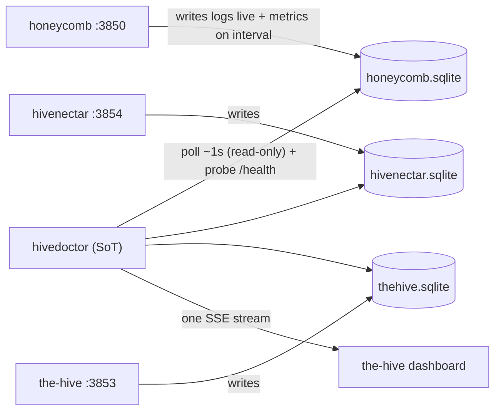

# ADR-0001, hive telemetry transport and hivedoctor as the single source of truth

> **Status:** Active · **Date:** 2026-07-01
> **Supersedes:** none · **Refines:** hivenectar [`ADR-0003`](../../../../hivenectar/library/knowledge/private/architecture/ADR-0003-three-daemon-topology-and-thehive-portal.md) (the three-daemon topology) and hivenectar [`ADR-0004`](../../../../hivenectar/library/knowledge/private/architecture/ADR-0004-thehive-portal-daemon-role-and-boundaries.md) (thehive aggregates health, not Deep Lake)
> **Owners:** platform, hivedoctor, the-hive
> **Related:** the-hive [`ADR-0003`](../../../../the-hive/library/knowledge/private/architecture/ADR-0003-future-sse-streaming-for-dashboard-freshness.md), the-hive [`ADR-0004`](../../../../the-hive/library/knowledge/private/architecture/ADR-0004-portal-landing-gate-and-path-based-routing.md), [`ADR-0002`](./ADR-0002-service-registration-static-registry-plus-runtime-sqlite.md)

## Context

The Apiary runs a four-process fleet: honeycomb (workload daemon, `:3850`), hivenectar (workload daemon, `:3854`), the-hive (always-on portal, `:3853`), and hivedoctor (the supervisor watchdog, loopback status page `:3852`). hivedoctor already supervises the workload daemons from a static registry and serves a coarse `GET /status.json` (per-daemon `ok|degraded|unreachable|unknown` only, no metrics). the-hive already consumes that status via its `/api/fleet-status` route.

Two forces converge:

1. The portal needs far more than coarse health: it needs live metrics (actions taken, files processed, memories created since last restart), live logs at selectable verbosity, and Deep Lake connection/stats, rendered in near real time.
2. hivedoctor is deliberately a "can't-crash", ZERO-runtime-dependency watchdog (Node built-ins only). Any telemetry mechanism it gains must not add an external dependency or a failure mode that can wedge it.

The question this ADR settles: how does telemetry flow from each service to hivedoctor, and from hivedoctor to the portal?

## Decision drivers

- A dying service cannot reliably push a "I am crashing" message before it dies, so a push channel from services is exactly the wrong shape for the failure we care most about.
- hivedoctor must stay dependency-light and crash-proof.
- Memory must stay bounded: the portal wants live logs, but hivedoctor must never hold whole log histories in memory.
- The portal wants one authoritative, near-real-time feed, not N direct connections to N services.

## Decision

**Services write to SQLite; hivedoctor polls and owns the truth; one SSE stream feeds the portal.**

1. **Services are producers, SQLite is the transport.** Each service (honeycomb, hivenectar, the-hive, and any future product) writes its own NON-SENSITIVE telemetry to its OWN local SQLite database: logs written live, health and metric check-ins written on an interval. Services never push to hivedoctor.
2. **hivedoctor is the puller and the single source of truth.** hivedoctor polls each registered service's SQLite database (about once per second) and probes each service's `/health`, merges the results into an in-memory model, and is the one authoritative source of hive health and telemetry. Which databases/tables it polls comes from the registry ([`ADR-0002`](./ADR-0002-service-registration-static-registry-plus-runtime-sqlite.md)).
3. **One SSE stream, hivedoctor to the-hive.** hivedoctor maintains exactly one Server-Sent-Events stream to the-hive, which renders the health rail, the `/buzzing` readiness screen, and the health page in near real time. There is NO service-to-hivedoctor SSE and no other streaming surface. This makes real the future direction the-hive [`ADR-0003`](../../../../the-hive/library/knowledge/private/architecture/ADR-0003-future-sse-streaming-for-dashboard-freshness.md) recorded as Proposed, scoped to the single hivedoctor to the-hive hop.
4. **Zero-dependency SQLite.** hivedoctor uses Node's built-in `node:sqlite` (Node >= 22.5, the `--experimental-sqlite` builtin honeycomb already relies on for its local queue), so it gains SQLite access without any external runtime dependency, preserving the watchdog's zero-dep ethos. Databases run in WAL mode so a service writes while hivedoctor reads without lock contention. hivedoctor opens service databases read-only.

Memory stays bounded because hivedoctor queries windows (recent rows, aggregates) rather than loading whole logs; the portal pages request bounded slices over the SSE feed.

## Consequences

**Positive.**

- Robust to crashes: a service that dies simply stops updating its SQLite rows and stops answering `/health`; hivedoctor detects it within roughly one poll interval, no lost "dying" push required.
- hivedoctor stays crash-proof and dependency-light (built-in `node:sqlite` only).
- Decoupled producer/consumer: services do not need to know hivedoctor's address or protocol; they only write local files.
- One authoritative feed to the portal, not N browser-to-daemon connections.

**Negative.**

- Detection latency is roughly the poll interval (about 1s), acceptable for a local operator dashboard but not instantaneous.
- hivedoctor must manage many SQLite readers and be disciplined about windowed queries to keep memory bounded.
- SQLite schemas become a contract between each service (writer) and hivedoctor (reader); schema drift must be handled additively (owned by hivedoctor PRD-002 and the per-service PRDs).

**Reversibility.** Moderate. The producer/consumer split via SQLite is a clean seam; a future move to a push or hybrid model would change hivedoctor's ingestion side and the service writers, but the portal-facing SSE contract would be unaffected.

## Alternatives considered and rejected

### Services push health/logs to hivedoctor over SSE or HTTP (REJECTED)

Each service opens a stream (or posts) to hivedoctor. Rejected because the failure we most need to detect, a crash, is precisely when a service cannot push; it also adds N inbound streams, makes hivedoctor a server for its supervisees (inverting the watchdog relationship), and couples every service to hivedoctor's address and protocol.

### Hybrid: SQLite for logs/metrics, plus a lightweight push for immediate state changes (CONSIDERED, REJECTED for v1)

Keep the SQLite pull for bulk telemetry but add a small service-to-hivedoctor push so a clean shutdown or state change is reflected instantly. Deferred: it reintroduces an inbound channel and its failure modes for a marginal latency win over a 1s poll. Can be revisited if sub-second state transitions ever matter.

### hivedoctor reads each service's data over HTTP `/metrics` instead of SQLite (REJECTED)

Rejected because it requires each service to keep serving while degraded, does not survive a crashed-but-not-exited process well, and does not give the portal durable history; SQLite gives durable, queryable, crash-surviving local state for free.

## Relationship to the corpus ADRs

- hivenectar [`ADR-0004`](../../../../hivenectar/library/knowledge/private/architecture/ADR-0004-thehive-portal-daemon-role-and-boundaries.md) decision #2 (thehive holds no Deep Lake client; it aggregates from daemon APIs) is unchanged: the portal still holds no data plane. This ADR routes fleet health/telemetry through hivedoctor as SoT rather than through per-daemon API aggregation, which is complementary (workload data via the-hive's BFF proxy per the-hive ADR-0002; fleet health/telemetry via hivedoctor's SSE per this ADR).
- the-hive [`ADR-0003`](../../../../the-hive/library/knowledge/private/architecture/ADR-0003-future-sse-streaming-for-dashboard-freshness.md): this ADR makes its Proposed SSE real, but only for the hivedoctor to the-hive health/telemetry feed.

## References

- `hivedoctor/src/status-page/server.ts` - the current coarse `/status.json` this telemetry feed enriches.
- `hivedoctor/src/registry.ts` - the registry that will also record each service's SQLite database location (see [`ADR-0002`](./ADR-0002-service-registration-static-registry-plus-runtime-sqlite.md)).
- hivenectar [`prd-004`](../../../../hivenectar/library/requirements/backlog/prd-004-hivedoctor-registry-and-thehive/prd-004-hivedoctor-registry-and-thehive-index.md) - the registry + thehive module this builds on.
- Forthcoming hivedoctor [`prd-001`](../../../requirements/backlog/prd-001-service-registration-and-telemetry-ingestion/prd-001-service-registration-and-telemetry-ingestion-index.md) (registration + ingestion) and [`prd-002`](../../../requirements/backlog/prd-002-telemetry-sot-sse-and-schema/prd-002-telemetry-sot-sse-and-schema-index.md) (SSE + schema) implement this ADR.
