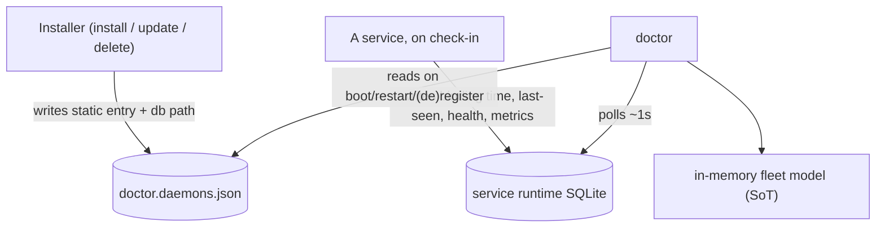

# ADR-0002, service registration: static installer registry plus runtime SQLite status

> **Status:** Active · **Date:** 2026-07-01
> **Supersedes:** none · **Refines:** nectar [`ADR-0004`](../../../../../nectar/library/knowledge/private/architecture/ADR-0004-hive-portal-daemon-role-and-boundaries.md) and the PRD-004a registry it introduced
> **Owners:** platform, doctor
> **Related:** [`ADR-0001`](./ADR-0001-hive-telemetry-transport-and-single-source-of-truth.md), the-apiary [`ADR-0002`](../../../../../library/knowledge/private/architecture/ADR-0002-one-line-installer-product-loading-and-install-time-telemetry.md)

## Context

doctor supervises the fleet from a static JSON registry at `~/.honeycomb/doctor.daemons.json` (introduced by nectar PRD-004a). Each entry today carries `name`, `healthUrl`, `pidPath`, and the per-daemon supervision knobs (`probeIntervalMs`, `startupGraceMs`, `restartGiveUpThreshold`, `restartCooldownMs`); the root is `{ "daemons": [ ... ] }`. doctor reads this file on boot and falls back to the honeycomb primary when it is absent, and (per the recent fail-soft change) surfaces a needs-attention record rather than crash-looping when it is malformed.

[`ADR-0001`](./ADR-0001-hive-telemetry-transport-and-single-source-of-truth.md) makes doctor the single source of truth by polling each service's SQLite database and `/health`. That requires doctor to know, per service: that it should exist (even while it is down), how to supervise it, where its SQLite database lives, and its live runtime state (last check-in, binding time, last-seen, health, metrics). A single JSON file cannot cleanly hold both the static "should exist" contract and the churning runtime state.

## Decision

**Two layers: an installer-written static registry, and a service-written runtime SQLite status.**

1. **Static registry (installer-owned).** The installer writes `doctor.daemons.json`, extended so each entry also records where that service's SQLite database(s) live (the path[s] doctor polls per [`ADR-0001`](./ADR-0001-hive-telemetry-transport-and-single-source-of-truth.md)). This layer answers "who SHOULD exist and how do I supervise it", and it must survive while a service is down, so doctor still supervises, probes, and restarts a stopped service. Registration is created on install and updated on install / update / deletion of a product (the installer owns those writes; see the-apiary [`ADR-0002`](../../../../../library/knowledge/private/architecture/ADR-0002-one-line-installer-product-loading-and-install-time-telemetry.md)).
2. **Runtime status (service-owned, SQLite).** On check-in, each service writes its runtime state (registration record, binding time, last-seen, current health, metrics) into SQLite. This is the churning, live layer.
3. **doctor merges.** doctor loads the static registry into memory on boot, restart, or explicit registration/deregistration, and retains in memory who to poll for health and which SQLite databases/tables to check. It merges the static "should exist" list with the runtime status to produce the authoritative fleet model. On a service disconnect (missed check-ins + failing `/health`), doctor records a last-seen time.

The static registry stays the durable source for supervision; the runtime SQLite is the live source for telemetry. doctor is the only reader that unifies them.

## Consequences

**Positive.**

- doctor can supervise a service that is currently DOWN, because the static "should exist" entry persists independently of runtime state.
- Runtime churn (health flaps, metric updates, last-seen) never rewrites the installer's static config.
- Clean ownership: installers own the static registry; services own their runtime rows; doctor owns the merge.

**Negative.**

- Two sources to keep coherent; a service registered statically but never checking in shows as "registered but never seen" (which is the correct, useful signal).
- The registry schema grows (SQLite db path[s] per entry); the extension must stay backward compatible with the existing PRD-004a parser and its fail-soft fallback.

**Reversibility.** Moderate. The static layer is the existing registry extended; the runtime layer is additive SQLite. Collapsing to one store later would be a migration, but the two-layer split is the low-risk starting point.

## Alternatives considered and rejected

### Unify everything into a single SQLite registration table (REJECTED)

One table that both installers and runtime check-ins write, dropping the JSON registry. Rejected because it loses the durable, human-editable "who should exist while down" list doctor needs to keep supervising a stopped service; it also couples install-time writes and high-frequency runtime writes into one contended store.

### Keep the JSON registry only and add runtime fields to it (REJECTED)

Cram last-seen/health/metrics into `doctor.daemons.json`. Rejected because it turns a static installer-owned config file into a high-churn runtime file (rewritten every check-in), fighting the atomic-write + fail-soft-parse posture and inviting corruption.

## References

- `doctor/src/registry.ts` - the static registry loader/parser this extends (schema, fallback, fail-soft).
- nectar [`prd-004`](../../../../../nectar/library/requirements/backlog/prd-004-doctor-registry-and-hive/prd-004-doctor-registry-and-hive-index.md) (PRD-004a registry + 004d registration) this builds on.
- the-apiary [`ADR-0002`](../../../../../library/knowledge/private/architecture/ADR-0002-one-line-installer-product-loading-and-install-time-telemetry.md) - the installer that creates/updates registration on install/update/delete.
- Forthcoming doctor [`prd-001`](../../../requirements/backlog/prd-001-service-registration-and-telemetry-ingestion/prd-001-service-registration-and-telemetry-ingestion-index.md) implements this ADR.
