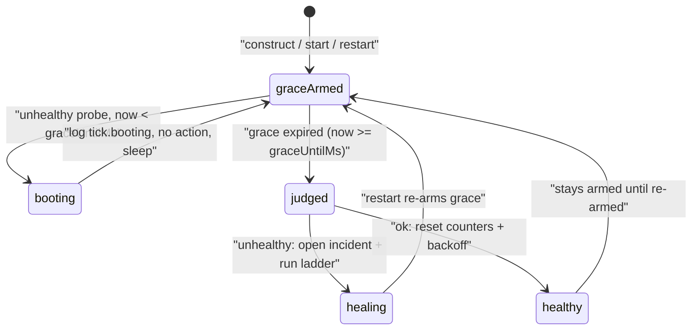

# Backoff And Restart Policy

> Category: Architecture | Version: 1.0 | Date: July 2026 | Status: Active | Author: Mario Aldayuz

For engineers touching `src/backoff.ts`, the restart rung, or the give-up-and-advance logic: this is the geometric backoff machine, how startup grace interacts with it, and the exact counters that carry a crash loop's memory across doctor's own restarts.

**Related:**
- [supervision-and-remediation.md](./supervision-and-remediation.md)
- [health-probe-classification.md](./health-probe-classification.md)
- [remediation-rungs-deep-dive.md](./remediation-rungs-deep-dive.md)
- [../data/registry-and-state.md](../data/registry-and-state.md)
- [../operations/status-page-and-cli.md](../operations/status-page-and-cli.md)
---

## Two rungs that are easy to confuse

There are two independent counters in doctor's remediation, and keeping them separate is the first thing to understand. The **remediation rung** is which repair action runs: rung 1 is restart, rung 2 is reinstall, rung 3 is uninstall-conflicting-package. The **backoff rung** is a geometric step count that governs how long doctor waits between attempts. They live in different modules (`src/remediation.ts` versus `src/backoff.ts`), advance on different events, and are persisted as different fields (`currentRung` and `consecutiveRestartFailures` versus `backoffRung` in `src/state.ts`). This doc is about the backoff rung and the restart policy that drives it; the remediation rungs are in [remediation-rungs-deep-dive.md](./remediation-rungs-deep-dive.md).

## The backoff machine is pure

`createBackoff` in `src/backoff.ts` is a pure value object: no timers, no I/O, no clock. It computes the next delay and advances or resets an integer rung. The supervisor owns the actual sleeping and the persistence; the machine only does arithmetic, which is what makes it trivially testable with a seeded RNG.

```typescript
export interface Backoff {
	readonly rung: number;
	delayMs(): number;
	advance(): number;
	reset(): void;
}
```

The delay for the current rung is `floorMs * 2^rung`, clamped to `ceilingMs` before jitter, then multiplied by a symmetric jitter factor:

```typescript
const factor = rung >= 30 ? ceiling / floor : 2 ** rung;
const base = clamp(floor * factor, floor, ceiling);
const jittered = base * (1 - jitter + random() * (2 * jitter));
return Math.round(clamp(jittered, floor, ceiling));
```

Three details are deliberate:

- **The `rung >= 30` guard** prevents `2 ** rung` from overflowing into a meaningless huge number on a box that has been crash-looping for a very long time. Past rung 30 the base is simply pinned at the ceiling ratio, which is where the clamp would land it anyway.
- **The clamp happens before jitter**, so the jitter band is centered on the clamped value rather than on an unclamped exponential that would then be truncated. A rung at the ceiling still jitters symmetrically around the ceiling, not below it.
- **Jitter is symmetric and multiplicative**, a factor in `[1 - jitter, 1 + jitter]` (default jitter 0.2, so `[0.8, 1.2]`). This is the anti-stampede: a fleet of boxes that all flapped at the same moment do not retry in lockstep and hammer the daemon (or npm, at higher rungs) simultaneously.

The defaults come from `src/config.ts` `DEFAULTS`: floor 1s (`backoffFloorMs`), ceiling 30s (`backoffCeilingMs`). Config resolution normalizes an inverted pair (a ceiling below the floor clamps up to the floor) so a fat-fingered `DOCTOR_BACKOFF_CEILING_MS` can never produce a negative or inverted delay.

## The rung survives a reboot

The backoff rung is persisted to the daemon's state shard (`backoffRung` in `state-<name>.json`) precisely so that doctor restarting does not reset a crash loop's memory. The machine rehydrates from `initialRung` at construction. This is the difference between doctor's backoff and the daemon's own embed-supervisor, which uses a fixed in-memory `restartBackoffMs`: doctor generalizes it to a geometric schedule with a persisted rung, so a box that has failed to restart honeycomb ten times in a row does not forget that history when doctor itself is restarted by launchd.

A confirmed healthy tick resets the rung to zero. That reset is what makes the ladder and the backoff stop the instant health returns.

## The restart give-up counter

Separate from the backoff rung is `consecutiveRestartFailures`, the counter that decides when the ladder advances off rung 1. It is not a backoff concept; it is the remediation ladder's give-up threshold. But the two advance together on a genuine failed restart, so they are worth reading side by side. From `heal` in `src/supervisor.ts`, on a restart that genuinely failed (not a skip, not a success):

```typescript
deps.backoff.advance();
return {
	...state,
	consecutiveRestartFailures: state.consecutiveRestartFailures + 1,
	backoffRung: deps.backoff.rung,
};
```

Both increment on the same event. `consecutiveRestartFailures` drives the ladder's `decide()`: at or past `restartGiveUpThreshold` (default 3, per-daemon `restartGiveUpThreshold`), the ladder advances to rung 2. `backoffRung` drives how long the next attempt waits. A deliberate skip (cooldown, or lock-held-and-healthy) increments neither: only a genuine failed restart counts toward the give-up threshold, which is the rule that keeps doctor from advancing to a reinstall just because it correctly declined to double-restart a daemon that was already fine.

## Startup grace: the window before judgment

A daemon that was just started deserves time to boot before the watchdog judges it dead. Each supervisor arms a grace window of `startupGraceMs` (default 60s) at three moments, tracked as an absolute deadline `graceUntilMs` in `src/supervisor.ts`:

1. at construction (`armStartupGrace()` runs once in the factory),
2. at every `start()`,
3. whenever rung 1 kicks a restart (the `heal` path calls `armStartupGrace(now)` on a successful restart).

During the window an unhealthy probe logs `tick.booting` with the remaining ms and takes no action at all: no incident, no restart, no backoff advance.



There is a fourth arming point that lives outside the supervisor: the auto-update engine re-arms the primary supervisor's grace after a successful post-update restart (`restartDaemon` in `src/compose/index.ts` calls `primary.supervisor.armStartupGrace()`). A freshly installed binary is never punished for a slow first boot, which is the boot-grace concern honeycomb's PRD-067 exists to cover.

## The full restart-attempt lifecycle

Putting the counters and the grace window together, one restart attempt over the ladder and backoff looks like this:

1. **Probe unhealthy, grace expired.** The loop opens an incident and asks the ladder for a rung. With `consecutiveRestartFailures` below threshold, that is rung 1 (restart).
2. **Rung 1 guards.** If doctor restarted this daemon within `restartCooldownMs` (default 5s), or if the PID lock is held and `/health` answers, rung 1 skips. A skip touches no counter and advances no backoff. Otherwise it runs the injected restart.
3. **Genuine failure.** `consecutiveRestartFailures` and `backoffRung` both increment. The persisted state carries both across doctor restarts.
4. **Next tick.** After the probe-interval sleep, the loop probes again. Health is confirmed on the next probe, never assumed from a kicked restart.
5. **Threshold reached.** Once `consecutiveRestartFailures` hits `restartGiveUpThreshold`, `decide()` advances to rung 2 (reinstall), and a genuine rung-2 failure escalates.
6. **Health returns.** A confirmed `ok` tick resets `consecutiveRestartFailures` to 0, `backoffRung` to 0, `currentRung` to 1, and stamps `lastHealAt`. Both memories are wiped together.

Note that the backoff `delayMs()` is a computed value the supervisor can consult, but the primary loop cadence between healthy ticks is the fixed `probeIntervalMs` (default 30s); the geometric delay governs the spacing of failed restart retries, and the persisted `backoffRung` is what makes that spacing survive a reboot rather than resetting to the floor.

## Invariants for contributors

- The backoff machine stays pure. New time-dependent behavior takes a clock/RNG seam or it is untestable.
- The `rung >= 30` overflow guard stays. Removing it lets `2 ** rung` produce `Infinity` on a long crash loop.
- Clamp before jitter. Jittering an unclamped exponential and then clamping loses the symmetric band.
- A deliberate skip increments neither `consecutiveRestartFailures` nor `backoffRung`. Only a genuine failed restart does.
- Both counters reset only on a confirmed `ok` probe, never on a kicked restart.
- Startup grace is per-daemon and absolute-deadline based. New restart paths that start a daemon must re-arm the grace, or the very next tick will judge the booting daemon dead.
