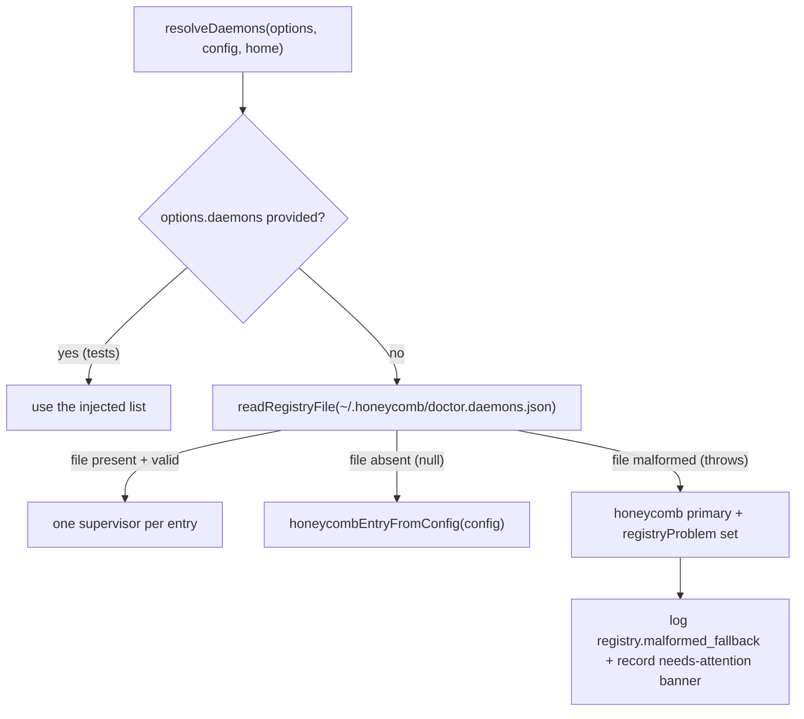

# The Composition Root

> Category: Architecture | Version: 1.0 | Date: July 2026 | Status: Active | Author: Mario Aldayuz

For engineers reading `src/compose/index.ts`: this is how `createDoctor()` assembles the whole watchdog from wave-built primitives, the fallback ladder that resolves which daemons to supervise, why every external action is an injected seam, and how `start()` and `stop()` stay fail-soft.

**Related:**
- [system-overview.md](./system-overview.md)
- [supervision-and-remediation.md](./supervision-and-remediation.md)
- [remediation-rungs-deep-dive.md](./remediation-rungs-deep-dive.md)
- [../operations/escalation-and-needs-attention.md](../operations/escalation-and-needs-attention.md)
- [../operations/auto-update-engine.md](../operations/auto-update-engine.md)
- [../standards/zero-dependency-engineering.md](../standards/zero-dependency-engineering.md)
---

## One function builds the whole process

`createDoctor()` in `src/compose/index.ts` is the composition root: the single place every collaborator is constructed and wired together, returning a `{ start, stop }` handle the OS service execs. Everything the running process does is armed here. One `createDoctor()` call builds:

- one independent supervisor watch loop per registered daemon (probe, classify, heal via the ladder, persist per-daemon state and incident shards),
- the escalation hook wired to both the local needs-attention store and the hosted PostHog sink,
- the telemetry poll-and-merge loop feeding the `/events` SSE stream,
- the auto-update poll loop, gated on the resolved opt-out precedence,
- the hourly install-health telemetry heartbeat,
- the loopback status page on `:3852`.

The reason a single composition root exists, rather than each subsystem wiring itself, is testability and fail-soft discipline: every external action lives behind an injected seam with a production default, so the smoke test drives the entire assembly hermetically (no real sockets, no real npm, no real network), and every seam that could throw is replaced by one that resolves a value.

## Resolving which daemons to supervise

The first real decision `createDoctor()` makes is which daemons to supervise, and it is a three-step fallback ladder (`resolveDaemons`) that never crashes the boot path:



The three postures are all deliberate:

- **File absent.** `readRegistryFile` returns `null` and the root falls back to a single honeycomb entry derived from the resolved config, which preserves any `DOCTOR_*` env overrides (`honeycombEntryFromConfig`) rather than dropping to bare defaults.
- **File present and valid.** One supervisor per entry, in registry order, with the honeycomb primary listed first.
- **File present but malformed.** `readRegistryFile` throws `RegistryError`; `resolveDaemons` catches it, falls back to the honeycomb primary, and returns a `registryProblem` string. The root surfaces that as a loud `registry.malformed_fallback` log plus a needs-attention banner recommending manual intervention.

The malformed-file case is the load-bearing one. Throwing out of `createDoctor()` would exit the process, and the OS service unit's restart policy (launchd `KeepAlive`, systemd `Restart=always`) would restart doctor straight back into the same parse failure: a crash loop. The fallback refuses to hand the OS supervisor that crash loop.

## One supervisor per daemon, fully independent

`buildDaemon` constructs one fully independent supervisor per entry. Each daemon gets its own probe bound to its `healthUrl`, its own state and incident shards keyed by name (`state-<name>.json`, `incidents-<name>.ndjson`), its own restart rung reading its own `pidPath` with an entry-local `lastRestartAt` clock, its own backoff, and its own ladder with its own `restartGiveUpThreshold`. Nothing about one daemon's crash loop can contaminate another's remediation state:

```typescript
let entryLastRestartAt: number | null = null;
const entryRestartRung = createRestartRung({
	restart,
	readDaemonPid: () => readDaemonPid(entry.pidPath),
	isHealthy: entryIsHealthy,
	cooldownMs: entry.restartCooldownMs,
	clock,
	lastRestartAt: () => entryLastRestartAt,
	markRestarted: (at: number) => { entryLastRestartAt = at; },
});
```

The higher rungs (reinstall, uninstall) act on the primary honeycomb package regardless of which daemon triggered them, so they are stateless factories built once and shared across every entry's ladder. Only rung 1 is per-daemon, because only rung 1 reads a daemon-specific PID path and cooldown.

The primary (the first entry) backs the process-global surfaces: the exposed `supervisor`/`ladder`, the status page's top-level health, the install-health snapshot, and the auto-update restart re-arm. The exposed `supervisors` and `ladders` arrays let a test step each daemon's loop independently.

## Why every external action is injectable

`CreateDoctorOptions` is a long list of optional seams, and the pattern is uniform: each has a production default, and each can be overridden. The reason is stated plainly in the module header: "all I/O behind seams so the smoke test drives the whole assembly hermetic." The seams that matter most:

| Seam | Production default | Why it is injectable |
|---|---|---|
| `probe` | `probeHealth` over `config.healthUrl` | one override governs both supervisor and telemetry health |
| `restart` | a logged no-op returning `false` | the real OS restart is the service integration's job |
| `runner` | `createExecFileRunner` (execFile, no shell) | rungs 2/3 and auto-update never touch real npm in tests |
| `readDaemonPid` | reads the pid file from disk | tests assert the lock-held guard against a recorded path |
| `blessedChannel` | the real CDN fetch over global fetch | tests pass a recorder fetch so no real HTTP runs |
| `openTelemetryDb` | the real read-only `node:sqlite` reader | tests inject a fixture reader |
| `emitDeps` | the build-injected PostHog key + global fetch | tests inject a recorder so nothing is posted |
| `clock` | the real wall-clock (timers + `Date.now`) | tests step time deterministically |

The `restart` default deserves note: it is a logged no-op that returns `false` (`compose.restart_no_os_service`), which is an honest failure that drives the ladder toward escalation rather than a fake success. That same `restart` seam is forwarded to the update engine's `restartDaemon`, which re-arms the primary supervisor's startup grace on a successful restart.

## The self-update boundary is sacred here

The composition wires the auto-update engine hard-coded to the primary daemon package, `@legioncodeinc/honeycomb`. There is no code path in `createDoctor()` that installs `@legioncodeinc/doctor`; doctor updating itself is reachable only through the explicit CLI `self-update` command. This is enforced by construction, not by convention: the composition simply never constructs a self-update seam. See [../operations/auto-update-engine.md](../operations/auto-update-engine.md).

## The escalation hook and per-daemon isolation

The escalation hook the ladder calls on give-up is built per entry by `buildEscalationHookFor`, and it encodes a subtle isolation rule:

```typescript
const buildEscalationHookFor = (entryName: string): EscalationHook => {
	return async (record): Promise<void> => {
		if (entryName === "honeycomb") {
			needsAttention.record(record);
		}
		await hostedEscalation(record);
	};
};
```

Only the honeycomb primary writes the shared `needs-attention.json` file (the honeycomb dashboard's read seam). Every other daemon's escalation is durably recorded in its own `incidents-<name>.ndjson` shard, read back by `readPerDaemonEscalation` for the status page row. If every entry wrote the shared file, one daemon giving up (say nectar) would overwrite honeycomb's dashboard banner. The hosted PostHog sink fires for every entry regardless, because a give-up on any daemon is useful signal. The full escalation surface is in [../operations/escalation-and-needs-attention.md](../operations/escalation-and-needs-attention.md).

## Fail-soft start and idempotent stop

`start()` arms everything and never throws. The order matters: the crash net is installed first, so anything thrown during wiring or boot is caught. Then the status page starts best-effort (a bind failure is swallowed inside `start()` already). Then each loop's `start()` is called but not awaited, because each loop's promise resolves only when stopped; the root holds the promises and lets `stop()` resolve them. Every held promise gets a `void run.catch(...)` that logs an unexpected rejection without rethrowing.

```typescript
supervisorRuns = built.map((b) => b.supervisor.start());
pollRun = pollLoop.start();
telemetryPollRun = telemetryPollLoop.start();
installHealthStopped = false;
installHealthRun = runInstallHealthLoop();
```

`stop()` is idempotent and disarms everything: every supervisor loop, the update poll loop, the telemetry poll loop (plus `telemetryPollLoop.close()` to release every open SQLite handle so a stopped watchdog never holds a service's database file open), the install-health heartbeat, and the status page. It then `Promise.allSettled`s every held run promise so the loops unwind their final iteration, and removes the crash net last. The install-health loop is the one loop the composition owns directly rather than delegating: it emits one snapshot immediately on arm, then every `installHealthIntervalMs`, each emit fail-soft so a telemetry heartbeat can never wedge the loop.

## The shared install lock and device id

Two process-global resources are built once and shared. The install lock (`src/install-lock.ts`) serializes rung 2's reinstall against the auto-update engine so two `npm i -g` operations never interleave. The device id (`safeResolveDeviceId` wrapping `resolveDeviceId`) is the shared per-install UUID read from or minted into `~/.honeycomb/device.json`, stamped on every telemetry record and escalation so doctor and the daemon correlate to one install. Both resolve fail-soft: the lock returns `null` when held rather than throwing, and the device-id resolution has an `"unknown-device"` last-resort net for the impossible case that resolution throws.

## Invariants for contributors

- `createDoctor()` never throws. A new subsystem that can fail on construction gets a fail-soft wrapper or an injected default.
- `resolveDaemons` never throws out of boot. A malformed registry falls back and surfaces a banner; it does not crash-loop.
- Per-daemon state stays in per-daemon shards. Only the honeycomb primary writes the shared `needs-attention.json`.
- The auto-update engine stays hard-wired to the primary package. Nothing in the composition installs `@legioncodeinc/doctor`.
- `stop()` releases every SQLite handle and disarms every loop idempotently. A new loop that opens a resource adds a matching teardown in `stop()`.
- New external actions become injected seams with production defaults, or the smoke test can no longer run hermetically.
