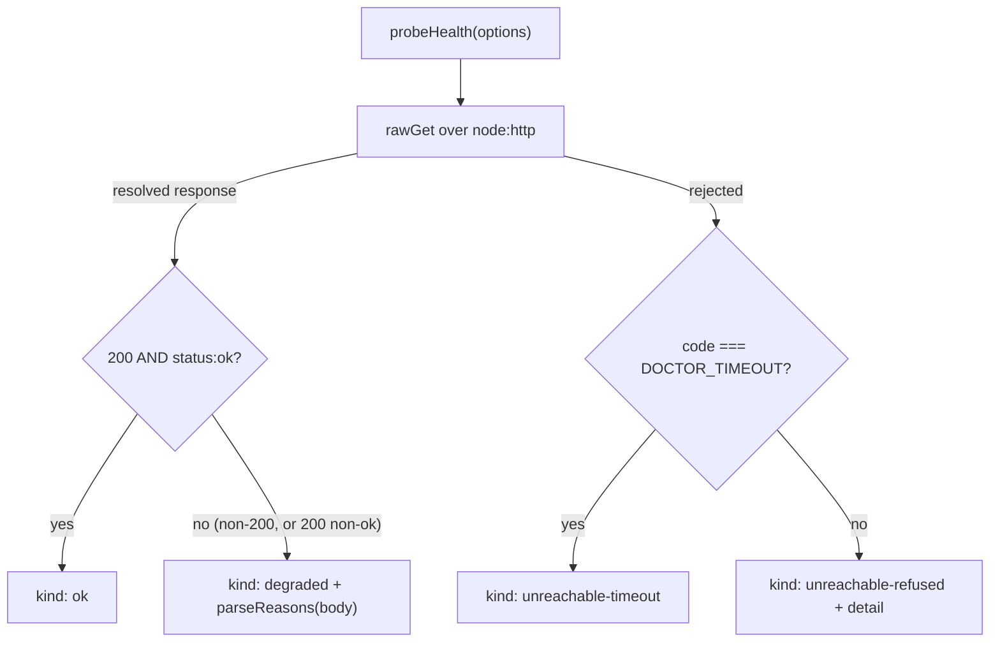

# Health Probe Classification

> Category: Architecture | Version: 1.0 | Date: July 2026 | Status: Active | Author: Mario Aldayuz

For engineers working on `src/health-probe.ts` or anything that reads a probe result: this is how doctor turns one HTTP GET into exactly one of four classifications, why the four kinds exist, and how both the supervisor and the telemetry poll loop consume them.

**Related:**
- [supervision-and-remediation.md](./supervision-and-remediation.md)
- [backoff-and-restart-policy.md](./backoff-and-restart-policy.md)
- [telemetry-single-source-of-truth.md](./telemetry-single-source-of-truth.md)
- [../data/registry-and-state.md](../data/registry-and-state.md)
- [../operations/status-page-and-cli.md](../operations/status-page-and-cli.md)
- [ADR-0002-service-registration-static-registry-plus-runtime-sqlite.md](./ADR-0002-service-registration-static-registry-plus-runtime-sqlite.md)
---

## Why four kinds and not a boolean

A watchdog that only knows "up" or "down" restarts everything the same way, which is the blind-restart loop doctor's third design principle exists to reject. The information that makes remediation targeted lives in the difference between the failure modes: a daemon that refused the connection is a different disease than one that accepted the socket and then went silent, and both differ from one that answered with a specific subsystem broken. `probeHealth` in `src/health-probe.ts` preserves that difference by resolving one of four mutually exclusive classifications:

```typescript
export type HealthClassification =
	| { readonly kind: "ok" }
	| { readonly kind: "degraded"; readonly reasons: ProbeHealthReasons }
	| { readonly kind: "unreachable-refused"; readonly detail: string }
	| { readonly kind: "unreachable-timeout" };
```

The type is the contract. Every downstream consumer (the supervisor's `tick`, the incident trigger mapping, the telemetry poll loop's health merge, the status page) reads `classification.kind` and nothing else has to guess.

## The probe never throws

`probeHealth` is a total function: every input, including a hard transport failure, maps to a classification. This is what lets the watch loop always make a decision and continue. The design principle is stated in the module header itself:

> The probe NEVER throws - any error resolves to a classification, so the loop can always continue.

That totality is load-bearing for crash-safety. The supervisor still wraps the call in try/catch (`tick.probe_threw` routes to the error-telemetry seam), but that guard is defense in depth against a test seam override, not the primary defense. In production `probeHealth` cannot throw, because every path inside it either resolves a classification or is caught.

## Node built-ins only: the transport

The probe issues one bounded `GET` over `node:http`'s `request`, not `fetch`, not an HTTP client, not a wrapper. This is design principle 1 (zero runtime dependencies) made concrete at the transport layer. `rawGet` builds the request, buffers the response, and resolves a small `RawResponse`:

```typescript
interface RawResponse {
	readonly statusCode: number;
	readonly body: string;
}
```

Two hardening details ride on `rawGet`, and both matter more than they look:

**Bounded body buffering.** The response body is accumulated chunk by chunk, but the accumulator refuses to grow past a hard cap:

```typescript
if (chunks.length < 256) chunks.push(chunk);
```

A `/health` endpoint that starts streaming megabytes (whether by bug or by malice) cannot exhaust memory in the process whose entire job is to not crash. The comment on that line reads "64 KiB is far more than /health needs", and it is: a health body is a few hundred bytes.

**A tagged timeout.** The distinction between refused and wedged (see below) depends on being able to tell a socket-level failure from a never-answered socket. `rawGet` arms `req.setTimeout` and, when it fires, destroys the request with an error carrying a stable code:

```typescript
req.setTimeout(timeoutMs, () => {
	req.destroy(Object.assign(new Error("probe_timeout"), { code: "DOCTOR_TIMEOUT" }));
});
```

The classifier keys off `code === "DOCTOR_TIMEOUT"` to route to `unreachable-timeout`, so a wedged socket is never mistaken for a refused connection.

## The classification decision

`probeHealth` awaits `rawGet` and applies a small total mapping:



- **`ok`** requires both HTTP 200 and a JSON body whose top-level `status` field reads `"ok"` (`isStatusOk`). A 200 with any other status is not ok.
- **`degraded`** is the answered-but-not-clean bucket: a non-200 response, or a 200 whose `status` is not `"ok"`. It carries `reasons` parsed defensively from the body. A body that is not JSON, or is JSON without a `reasons` object, still classifies degraded, just with an empty reasons object: the daemon answered, so it is not unreachable, but it is not clean either.
- **`unreachable-timeout`** is the tagged-abort path: the socket was accepted but no response arrived within `timeoutMs`. The daemon is alive but wedged.
- **`unreachable-refused`** is every other transport failure (connection refused, reset, DNS failure). It carries a `detail` string, preferring the error's `code` when present so an operator sees `ECONNREFUSED` rather than a message.

## Parsing subsystem reasons, defensively

When the daemon answers degraded, the body may carry per-subsystem detail mirroring the daemon's own `HealthReasons` shape:

```typescript
export interface ProbeHealthReasons {
	readonly storage?: string;
	readonly embeddings?: string;
	readonly schema?: string;
}
```

`parseReasons` extracts these three fields and nothing else. It is deliberately paranoid: a `null` parse, a non-object body, a missing `reasons` key, or a non-object `reasons` value all resolve to `{}` rather than throwing. Only string-typed subsystem values survive; anything else becomes `undefined`. The three subsystems are the daemon's `storage` (Deep Lake reachability), `embeddings` (the embed seam state), and `schema` (required-table presence). These are the same three subsystems the status page and incident records surface, and they are what a `degraded` incident carries in its `healthReasons` field so an operator reading `doctor logs` sees which subsystem opened the episode.

## How the two loops consume a classification

The classification feeds two independent consumers, and it means slightly different things to each.

**The supervisor** (`src/supervisor.ts`) maps the kind to a coarse persisted health via `coarseHealth` (`ok` stays `ok`, `degraded` stays `degraded`, both `unreachable-*` collapse to `unreachable`) and to an incident trigger via `triggerForClassification` in `src/incidents.ts`:

| Classification kind | Incident trigger | Coarse state |
|---|---|---|
| `ok` | (never opens an incident) | `ok` |
| `degraded` | `degraded` | `degraded` |
| `unreachable-refused` | `unreachable` | `unreachable` |
| `unreachable-timeout` | `timeout` | `unreachable` |

The refused-versus-timeout distinction survives all the way into the incident trigger, so `doctor logs` shows `timeout` for a wedged daemon and `unreachable` for a dead one. That trigger is the operator's hint that the box hit a backlog wedge rather than a crash. The full remediation flow that follows is in [supervision-and-remediation.md](./supervision-and-remediation.md).

**The telemetry poll loop** (`src/ingestion/poll-loop.ts`) calls the same probe per entry through its injected `probe` seam and collapses the classification into the fleet-visible vocabulary with `classifyProbe`: `ok` to `ok`, `degraded` to `degraded`, and both unreachable kinds to `unreachable`. That coarse health then merges with the service's own SQLite `service_status.health` and its `last_seen` staleness to produce one `FleetHealth` per service. The poll loop's own re-catch (`poll-loop.probe_threw`) is, again, defense in depth against an injected seam that throws, since the real `probeHealth` cannot. The merge rules are documented in [telemetry-single-source-of-truth.md](./telemetry-single-source-of-truth.md).

## The probe is injected everywhere it is used

Nothing in doctor calls `probeHealth` on a hard-coded URL in the hot path. The composition root builds a per-entry probe bound to each daemon's `healthUrl` and `config.probeTimeoutMs`, and passes it as a seam to both the supervisor and the telemetry loop (`buildDaemon` and `telemetryProbe` in `src/compose/index.ts`). A single injected `options.probe` overrides both at once, which is how the whole assembly stays hermetic under test: no test ever opens a real socket. The `healthUrl` itself is not trusted input; it is coerced to a loopback host at registry-parse time (`coerceHealthUrl`), the SSRF gate documented in [../security/trust-boundaries.md](../security/trust-boundaries.md).

## Invariants for contributors

- `probeHealth` MUST remain total: every new failure path resolves a classification, never throws.
- The body buffer cap MUST stay bounded. A new parse path that reads the whole body without a cap reintroduces the memory-exhaustion vector.
- The timeout MUST stay tagged (`DOCTOR_TIMEOUT`) so the refused-versus-timeout distinction survives. Removing the tag collapses two failure modes into one and blinds the incident trigger.
- `parseReasons` MUST stay defensive: a hostile or malformed body degrades to an empty reasons object, never a throw.
- New consumers read `classification.kind`; they do not re-probe or re-derive health from raw HTTP.
