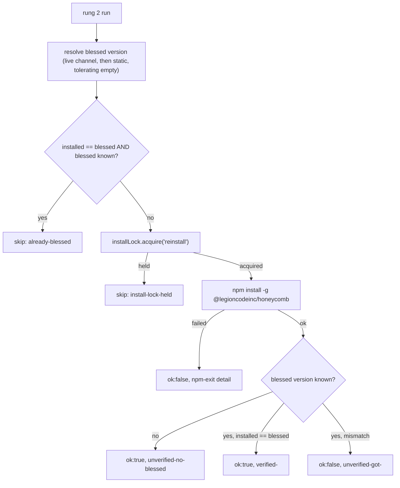

# Remediation Rungs Deep Dive

> Category: Architecture | Version: 1.0 | Date: July 2026 | Status: Active | Author: Mario Aldayuz

For engineers working on any rung in `src/remediation.ts` or `src/rungs/`: this is each repair action in full detail, the `RungResult` contract every rung honors, the `execFile` command-runner discipline they share, and the credential non-touch boundary that shapes rung 3 and escalation.

**Related:**
- [supervision-and-remediation.md](./supervision-and-remediation.md)
- [backoff-and-restart-policy.md](./backoff-and-restart-policy.md)
- [composition-root.md](./composition-root.md)
- [../operations/escalation-and-needs-attention.md](../operations/escalation-and-needs-attention.md)
- [../security/trust-boundaries.md](../security/trust-boundaries.md)
- [../standards/zero-dependency-engineering.md](../standards/zero-dependency-engineering.md)
---

## The contract every rung honors

A rung is one repair action. The ladder (`createRemediationLadder`) holds an ordered registry of them and, given a health classification and the consecutive-failure count, decides which to run. The invariant that makes the whole system crash-safe is that a rung resolves a value, never throws:

```typescript
export interface RungResult {
	readonly ok: boolean;
	readonly action: string;
	readonly detail?: string;
	readonly skipped?: boolean;
}
```

`ok` means the action completed and did its job. `skipped` means the rung deliberately did nothing (a guard fired). `action` is a short stable verb recorded in the incident step. `detail` is a secret-free note. The ladder wraps every `run` in try/catch anyway (`ladder.rung_threw` becomes a failed result), but a rung that throws is a bug: the header comment on `src/remediation.ts` states "a thrown rung should resolve a `RungResult`". The three outcome states (succeeded, failed, skipped) are exactly the `StepOutcome` values recorded in `incidents.ndjson`, so a rung's result maps one-to-one onto what an operator reads in `doctor logs`.

## The ladder's decision is pure

`decide()` takes the consecutive-restart-failure count and returns which rung to run, with no side effects:

```typescript
decide(consecutiveRestartFailures: number): LadderDecision {
	if (consecutiveRestartFailures >= deps.restartGiveUpThreshold) {
		return { rung: 2, advanced: true };
	}
	return { rung: 1, advanced: false };
}
```

Below the threshold (default 3), the ladder runs rung 1. At or past it, the ladder advances to rung 2. Rung 3 is never selected by `decide()` in the automated loop; it runs only when targeted directly (the `doctor uninstall-hivemind` CLI verb). Escalation is the terminal hand-off, not a numbered rung the ladder chooses. Because `decide()` is pure, the CLI's `diagnose` verb can consult it to show the recommended rung without ever running the ladder.

## The shared command runner

Every rung that touches npm goes through one injectable boundary, `CommandRunner`, whose production implementation is `createExecFileRunner` in `src/rungs/command-runner.ts`. The runner uses `node:child_process.execFile` with an argv array, never `exec`, never a shell, so a package name can never be reinterpreted as a shell metacharacter. Like every other external action in doctor, failure is a value:

```typescript
export interface CommandResult {
	readonly ok: boolean;
	readonly code: number | null;
	readonly stdout: string;
	readonly stderr: string;
	readonly detail?: string;
}
```

A non-zero exit, an ENOENT spawn failure, or a timeout kill all resolve to `ok: false`; the runner never rejects. Output is capped at `MAX_BUFFER_BYTES` (1 MiB) so a chatty npm cannot balloon memory, and the default per-command timeout is `DEFAULT_TIMEOUT_MS` (2 minutes, because global installs are slow).

### The cross-platform npm launch

One detail in the runner is load-bearing and non-obvious. `execFile("npm", args)` with no shell is broken on Windows, because `npm` there is `npm.cmd` / `npm.ps1`, not an executable image, so `execFile` fails to launch it with ENOENT. That silently broke every npm operation on Windows hosts, and it went unnoticed because the rungs were only ever unit-tested against the injected fake, so the real npm path never ran on a Windows CI host.

The fix keeps `shell: false` and runs npm's own JavaScript entry with the current Node binary. `planNpmSpawn` and `resolveNpmCliJs` locate `npm-cli.js` (via `createRequire` first, then known locations relative to `process.execPath`) and launch `execFile(process.execPath, [npmCliJsPath, ...args])`. `npm-cli.js` is a plain Node script on every OS, so this launches identically on Windows, macOS, and Linux with no shell and no metacharacter risk. Only when `npm-cli.js` cannot be located at all does the runner fall back: on Windows to `npm.cmd` with `shell: true` (documented-safe, because the only values that reach the shell are doctor's own fixed literals plus a semver-validated version), and on Unix to the direct `execFile("npm", args)` path.

## Rung 1: restart

`createRestartRung` in `src/remediation.ts` is the first repair, and it runs two guards before it does anything, in order:

**Guard 1, cooldown.** If doctor restarted this daemon within `restartCooldownMs` (default 5s), the rung skips with `detail: "cooldown"`. This is the anti-watchdog-war guard: doctor never fights the daemon's own restart helper by kicking a second restart while a fresh instance is still coming up.

**Guard 2, lock-held-and-healthy.** If the PID/lock file names a process and `/health` answers, the rung skips with `detail: "lock-held-and-healthy"`. Starting a second daemon would just hit the single-instance lock and exit, so there is nothing to do.

Only past both guards does the rung run the injected `RestartFn` and, on success, call `markRestarted` to start the cooldown clock and re-arm the supervisor's startup grace. A skip counts toward no threshold; a genuine failure (`restart-fn-returned-false`) increments `consecutiveRestartFailures` and advances backoff.

The production default restart is honest about a gap: until the OS-restart seam is wired by the service integration, the injected default logs `compose.restart_no_os_service` and returns `false`. That is a real failure that drives the ladder toward escalation, not a fake success that would hide the missing wiring.

## Rung 2: reinstall the primary

`createReinstallRung` in `src/rungs/reinstall.ts` fires after 3 consecutive failed restarts to fix a corrupted or stale global install of `@legioncodeinc/honeycomb` (the "stale global daemon serves old routes" failure mode). Its flow:



Four decisions matter here:

- **Blessed version resolution is fail-soft.** The rung prefers the live blessed channel (`resolveBlessedVersion`, wired to `fetchBlessedVersion`), falls back to a static value, and tolerates an empty string. A missing CDN object never blocks the repair.
- **The idempotency short-circuit** skips a reinstall entirely when the running version already matches blessed, so a healthy box is never needlessly reinstalled. With no blessed version known, doctor cannot prove the box is fine, so it never short-circuits.
- **The install runs only under the shared install lock** (`src/install-lock.ts`), so it can never race the auto-update engine. If the lock is held, the rung skips: the other installer is already doing the work.
- **The verify reads the globally-installed package version, not `/health`.** The reinstall fires precisely when the daemon is sick, when `/health` cannot be trusted; the composition root wires `readInstalledVersion` to the `npm ls -g` reader (see [composition-root.md](./composition-root.md)). With no blessed version to compare against, the rung reports `unverified-no-blessed` and still returns `ok: true`, because a missing channel must never fail an otherwise-successful repair.

## Rung 3: remove a conflicting Hivemind global

`createUninstallHivemindRung` in `src/rungs/uninstall-hivemind.ts` removes a conflicting `@deeplake/hivemind` global. Honeycomb and Hivemind are siblings that share one credential folder but cannot run side by side (duplicate capture/recall hooks, competing daemons). The rung's steps:

1. **Detect first.** `createNpmHivemindDetector` runs `npm ls -g @deeplake/hivemind --depth 0` and parses the version from stdout. Nothing detected is a safe idempotent skip (`no-conflicting-hivemind`, `ok: true`). A second run after a successful removal detects nothing and skips.
2. **Record before removing.** Before issuing the uninstall, `recordRemoval` appends a timestamped `RemovedPackageRecord` to `removed-packages.ndjson` in doctor's workspace. If that record cannot be written, the destructive step is skipped rather than performed unrecorded (`backup-record-failed`). The removal is auditable and reversible-by-record.
3. **Uninstall the package only.** `npm uninstall -g @deeplake/hivemind` removes the npm package.

The one hard boundary: rung 3 removes the npm PACKAGE only. There is literally no code path in it that writes to or deletes `~/.deeplake/`; credentials and onboarding state live there and honeycomb still depends on them. The only filesystem write rung 3 performs is the backup record under doctor's own workspace, resolved through `resolveInBase` (see [../security/trust-boundaries.md](../security/trust-boundaries.md)).

## Escalation: the terminal hand-off

When an advanced rung genuinely fails, the supervisor builds an `EscalationRecord` and hands it to the injected hook. Escalation is not a numbered rung; it is what the ladder does when the numbered rungs cannot restore health. The record is built by `buildEscalationRecord` in `src/rungs/escalation.ts`:

```typescript
export interface EscalationRecord {
	readonly diagnosis: string;
	readonly steps: readonly IncidentStep[];
	readonly recommendedAction: RecommendedAction;
	readonly wouldHaveTaken?: string;
	readonly at: string;
}
```

`runEscalation` isolates the hook in try/catch: a flaky sink becomes a failed step, never a process death, because escalation is the last thing the ladder does and it must not be the thing that finally crashes the can't-crash watchdog. When no hook is wired (a Wave-0 caller), `escalate` resolves a skipped result naming the missing hook, so the incident still records the escalation intent.

### The credential non-touch policy, and `wouldHaveTaken`

`RecommendedAction` is a closed union: `investigate`, `reinstall-primary`, `uninstall-conflicting-hivemind`, `clear-credentials`, `manual-intervention`. Of these, `clear-credentials` is the deferred action doctor is allowed to recommend but never perform. There is no credential-purge code path anywhere in the codebase. When the recommended action is deferred, `buildEscalationRecord` populates `wouldHaveTaken` from a single source of truth:

```typescript
const DEFERRED_ACTION_NOTES: Readonly<Partial<Record<RecommendedAction, string>>> = {
	"clear-credentials": "would clear ~/.deeplake/credentials.json (DEFERRED - not performed in v1)",
};
```

So the record always states the action doctor declined to take, which reaches a human without the action ever being automated. Downstream, the status page renders `clear-credentials` as a comment telling the operator to review the file themselves, never as a runnable command. The full escalation surface (the needs-attention store, the hosted sink, per-daemon isolation) is in [../operations/escalation-and-needs-attention.md](../operations/escalation-and-needs-attention.md).

## Invariants for contributors

- A rung resolves a `RungResult`, never throws. The ladder wraps it, but a throw is a bug.
- A deliberate skip never counts toward the give-up threshold. Only a genuine failure increments `consecutiveRestartFailures`.
- Every shell-out goes through the `CommandRunner` seam with an argv array. No new rung calls `exec` or builds a shell string.
- Any version string composed into an npm spec is semver-validated first (the update engine's `parseVersion` guard is the template).
- Rung 3 and escalation touch the npm package and doctor's own workspace only. No new code path reads or writes under `~/.deeplake/`.
- Destructive actions record before they act. If the record cannot be written, the action is skipped.
