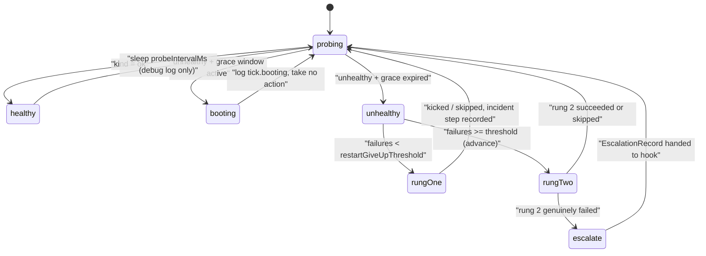

# Supervision And Remediation

> Category: Architecture | Version: 1.0 | Date: July 2026 | Status: Active | Author: Mario Aldayuz

For engineers working on the watch loop, health classification, the repair ladder, backoff, or incident records: this is how doctor decides a daemon is sick and what it does about it.

**Related:**
- [system-overview.md](./system-overview.md)
- [telemetry-single-source-of-truth.md](./telemetry-single-source-of-truth.md)
- [../data/registry-and-state.md](../data/registry-and-state.md)
- [../operations/status-page-and-cli.md](../operations/status-page-and-cli.md)
- [ADR-0002-service-registration-static-registry-plus-runtime-sqlite.md](./ADR-0002-service-registration-static-registry-plus-runtime-sqlite.md)
---

## One supervisor per daemon

`createDoctor()` builds one fully independent supervisor per registry entry (`buildDaemon` in `src/compose/index.ts`). Each daemon gets its own probe bound to its `healthUrl`, its own restart rung reading its own `pidPath` with an entry-local cooldown clock, its own backoff machine, its own ladder with its own `restartGiveUpThreshold`, and its own state and incident shards (`state-<name>.json`, `incidents-<name>.ndjson`). Nothing about nectar's crash loop can contaminate honeycomb's remediation state.

The loop cadence and windows come from the registry entry, defaulting to the values in `src/config.ts` `DEFAULTS`: probe every 30s (`probeIntervalMs: 30_000`), 2s per-probe timeout (`probeTimeoutMs: 2_000`), 60s startup grace (`startupGraceMs: 60_000`), give up on restarts after 3 consecutive failures (`restartGiveUpThreshold: 3`), 5s post-restart cooldown (`restartCooldownMs: 5_000`), backoff floor 1s and ceiling 30s (`backoffFloorMs` / `backoffCeilingMs`).

## The tick

`Supervisor.tick()` in `src/supervisor.ts` is the whole algorithm: probe, classify, and either rest or heal. The clock and every I/O action are injected, so tests step the loop deterministically with fake timers.



On a healthy tick the loop logs `tick.healthy` at debug and, only if there is something to reset (a non-zero failure count, a non-zero backoff rung, or a previous non-ok health), writes state back with `consecutiveRestartFailures: 0`, `backoffRung: 0`, `currentRung: 1`, and a fresh `lastHealAt`. Reset-on-healthy is what makes the ladder stop the instant health returns.

On an unhealthy tick past the grace window, the loop opens an incident episode, asks the ladder to decide a rung, runs it, records the step, persists state, and writes the episode. The whole tick sits inside try/catch: a thrown heal path logs `tick.heal_threw`, routes to the error-telemetry seam, and the loop survives to the next tick.

## The four health kinds

`probeHealth` in `src/health-probe.ts` issues one bounded `GET` over `node:http` and never throws. It resolves exactly one of four classifications:

```typescript
export type HealthClassification =
	| { readonly kind: "ok" }
	| { readonly kind: "degraded"; readonly reasons: ProbeHealthReasons }
	| { readonly kind: "unreachable-refused"; readonly detail: string }
	| { readonly kind: "unreachable-timeout" };
```

- `ok`: HTTP 200 with a JSON body whose top-level `status` is `"ok"`.
- `degraded`: the daemon answered but not cleanly (non-200, or 200 with a non-ok status). Carries the per-subsystem `reasons` (`storage`, `embeddings`, `schema`) parsed defensively from the body; a non-JSON body still classifies degraded, just without detail.
- `unreachable-refused`: the connection was refused, reset, or failed DNS. The daemon is down. Restart it.
- `unreachable-timeout`: the socket accepted but never answered within `probeTimeoutMs`. The daemon is wedged, which is a different disease than dead (the memory_jobs-backlog failure mode PRD-064a exists to fix).

The refused-versus-timeout distinction is load-bearing: it flows into the incident trigger (`unreachable` vs `timeout` via `triggerForClassification` in `src/incidents.ts`) and into what an operator reads on the status page. The response body is buffered to a hard cap (256 chunks) so a misbehaving endpoint streaming megabytes cannot exhaust memory.

## Startup grace

A daemon that was just started deserves time to boot before the watchdog judges it. Each supervisor arms a grace window of `startupGraceMs` (default 60s) at construction, at `start()`, and again whenever rung 1 kicks a restart. During the window an unhealthy probe logs `tick.booting` with the remaining ms and takes no action. The auto-update engine also re-arms the primary supervisor's grace after a successful post-update restart (PRD-067), so a fresh binary is never punished for a slow boot.

## The repair ladder

`createRemediationLadder` in `src/remediation.ts` holds the rung registry and the pure `decide()` function: fewer than `restartGiveUpThreshold` consecutive failed restarts means rung 1; at or past the threshold it advances to rung 2. The composition root registers rungs 1, 2, and 3 for every daemon's ladder (`rungs: [entryRestartRung, reinstallRung, uninstallRung]` in `src/compose/index.ts`). Escalation is the terminal hand-off, not a numbered rung.

**Rung 1: restart (`src/remediation.ts` `createRestartRung`).** Two guards run before anything happens. Guard one: if doctor restarted this daemon within `restartCooldownMs` (default 5s), skip with `detail: "cooldown"`, so doctor never fights the daemon's own restart helper. Guard two: if the PID/lock file names a process and `/health` answers, skip with `detail: "lock-held-and-healthy"`, because starting a second daemon would just hit the single-instance lock and exit. Otherwise run the injected `RestartFn` and start the cooldown. A deliberate skip never counts toward the give-up threshold; a genuine failure increments `consecutiveRestartFailures` and advances backoff. Note the production default: until the OS-restart seam is wired by the service integration (PRD-064b/064h territory), the injected default restart logs `compose.restart_no_os_service` and returns `false`, which is an honest failure that drives the ladder toward escalation rather than a fake success.

**Rung 2: reinstall the primary (`src/rungs/reinstall.ts`).** Fires after 3 consecutive failed restarts. It resolves the blessed version fail-soft (live channel first, static fallback, empty string tolerated), short-circuits to a skip if the installed version already matches the blessed one, acquires the shared install lock so it can never race the auto-update engine, then runs `npm install -g @legioncodeinc/honeycomb` through the execFile runner and verifies against the globally-installed package version (not `/health`, which cannot be trusted while the daemon is sick). With no blessed version known it still reinstalls but reports `unverified-no-blessed` instead of failing: a missing CDN object never blocks a repair.

**Rung 3: uninstall a conflicting Hivemind global (`src/rungs/uninstall-hivemind.ts`).** Honeycomb and `@deeplake/hivemind` cannot run side by side. Detection first (`npm ls -g @deeplake/hivemind --depth 0`); nothing detected means a safe idempotent skip. Before removal it appends a timestamped backup record to `removed-packages.ndjson` in doctor's workspace; if that record cannot be written, the destructive step is skipped rather than performed unrecorded. The one hard boundary: rung 3 removes the npm package only and has literally no code path that touches `~/.deeplake/`. In the automated loop `decide()` only ever selects rungs 1 and 2; rung 3 runs when targeted directly (the `doctor uninstall-hivemind` CLI verb, or `heal` when the decision routes there in later waves).

**Escalation (terminal, `src/rungs/escalation.ts`).** When an advanced rung genuinely fails (not a skip, not a success), the supervisor builds an `EscalationRecord`: a plain-language diagnosis, the ordered steps attempted with outcomes, a `recommendedAction`, and, for deferred actions, a `wouldHaveTaken` note. The record goes to the injected escalation hook crash-safely; a throwing sink becomes a failed step, never a process death. For the honeycomb primary the hook writes `needs-attention.json` (the dashboard read seam) and emits to the hosted PostHog sink; for every other daemon the escalation lives in its own incident shard plus the hosted sink, deliberately not the shared file, so nectar's give-up can never overwrite honeycomb's banner. `clear-credentials` is only ever a recommendation; there is no purge code anywhere.

## Backoff

`createBackoff` in `src/backoff.ts` is a pure state machine: delay is `floorMs * 2^rung`, clamped to `ceilingMs` before jitter, then multiplied by a symmetric jitter factor in `[0.8, 1.2]` (jitter 0.2 by default) so a fleet that flapped together does not stampede the daemon in lockstep. Defaults: floor 1s, ceiling 30s. The backoff rung (geometric step count) is distinct from the remediation rung (which repair runs) and is persisted to the state shard, so a reboot does not reset a crash loop's memory. A confirmed healthy tick resets it to zero.

## Incident episodes

Every unhealthy tick past grace produces one `Incident` line in the daemon's incident shard (`src/incidents.ts`): a UUID id, `openedAt`/`closedAt`, the trigger (`unreachable` | `timeout` | `degraded` | `unknown`), the health kind and degraded reasons at trigger time, the ordered steps with outcomes (`succeeded` | `failed` | `skipped`), and `resolved`. The file is append-only NDJSON, capped at 5 MiB with a single-generation rotation to `.ndjson.1`. A failed append is swallowed and logged: the healing matters more than the record of it.

## A worked incident

Kill honeycomb (`pkill -f honeycomb`) and watch one episode end to end:

1. Next tick (within 30s): the probe's socket is refused. Classification `unreachable-refused`, grace long expired, log `tick.unhealthy`.
2. The loop opens an incident with trigger `unreachable` and asks the ladder: 0 consecutive failures, so rung 1.
3. Rung 1 guards pass (no recent restart, no live lock), the restart fn kicks the OS service, `markRestarted` starts the 5s cooldown, the grace window re-arms for 60s, and the step `{ rung: 1, action: "restart-daemon", outcome: "succeeded" }` is recorded. State persists `lastRestartAt`; the episode is written.
4. Next tick: the daemon is still booting, probe says refused, but grace is active, so the loop logs `tick.booting` and does nothing. No incident, no double restart.
5. Two ticks later: `/health` answers `{ status: "ok" }`. The loop resets failures and backoff to zero, stamps `lastHealAt`, and goes quiet. `doctor status` now shows the heal; the status page shows `ok`.

Had the restart failed three ticks running, `decide()` would have advanced to rung 2, the reinstall would have run under the install lock, and a genuine rung 2 failure would have produced an escalation record on the status page, in `needs-attention.json`, and (unless opted out) at the hosted sink.

## Invariants for contributors

Touching this path means preserving these, and the test suite asserts most of them:

- A rung MUST resolve a `RungResult`, never throw; the ladder wraps it anyway, but a throw is a bug.
- A deliberate skip never counts toward the give-up threshold. Only a genuine failed restart increments `consecutiveRestartFailures`.
- Health is confirmed on the NEXT probe, never assumed from a kicked restart; failure counters reset only on a confirmed `ok`.
- Every timer and clock is injected. New time-dependent behavior takes a `clock`/`now` seam or it will be untestable and flaky.
- The error-telemetry seam (`onError`) is fire-and-forget and fail-soft; it must never change control flow in the tick.
- Per-daemon state stays in per-daemon shards. Nothing new writes cross-daemon shared state except the honeycomb-only `needs-attention.json` seam, which exists for the dashboard and is deliberately primary-scoped.
