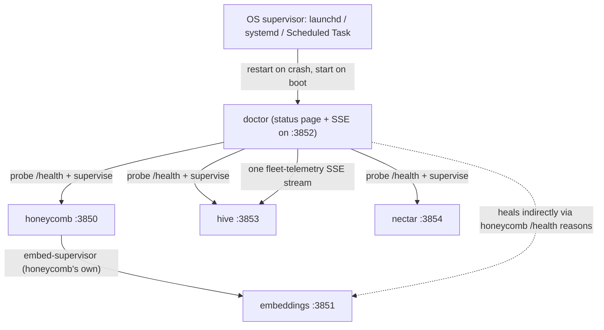

# System Overview: Why Doctor Exists

> Category: Architecture | Version: 1.0 | Date: July 2026 | Status: Active | Author: Mario Aldayuz

Read this first if you are new to the doctor repo: it explains why the watchdog exists, the four principles every module obeys, the fleet it supervises, and where the code came from.

**Related:**
- [supervision-and-remediation.md](./supervision-and-remediation.md)
- [composition-root.md](./composition-root.md)
- [telemetry-single-source-of-truth.md](./telemetry-single-source-of-truth.md)
- [../standards/zero-dependency-engineering.md](../standards/zero-dependency-engineering.md)
- [../data/registry-and-state.md](../data/registry-and-state.md)
- [../operations/status-page-and-cli.md](../operations/status-page-and-cli.md)
- [../security/trust-boundaries.md](../security/trust-boundaries.md)
- [ADR-0001-hive-telemetry-transport-and-single-source-of-truth.md](./ADR-0001-hive-telemetry-transport-and-single-source-of-truth.md)
- [ADR-0002-service-registration-static-registry-plus-runtime-sqlite.md](./ADR-0002-service-registration-static-registry-plus-runtime-sqlite.md)
---

## The problem: who restarts the restarter

The Apiary's memory daemon dies at 2am and nothing notices. The user finds out the next morning, one session in, when their agent has forgotten a codebase it knew yesterday. Honeycomb already had internal supervision (its embed-supervisor restarts the embeddings child), but nothing supervised honeycomb itself, and nothing supervised the supervisor either. Every self-monitoring scheme eventually hits the same wall: the monitor shares a failure domain with the thing it monitors.

Doctor is the answer to that wall, and it is deliberate about where it draws the line. Doctor supervises the workload fleet. The operating system supervises doctor. launchd, systemd, or a Windows Scheduled Task restarts doctor on crash and starts it on boot, so doctor never depends on anything it watches to stay alive, and nothing it watches depends on doctor to run. Doctor is Mario Aldayuz's answer to that specific design problem in The Apiary: the stack needed one process dumber, smaller, and tougher than everything else, standing outside every failure domain it observes.

## The four design principles

Every module in `src/` cites these by number in its header comments. They are not aspirations; they are enforced shapes.

**1. Incapable of crashing.** The runtime is Node built-ins only, zero npm dependencies (`package.json` declares none; `esbuild.config.mjs` externalizes only `node:*`). There is no zod, no HTTP client, no CLI framework. Every external action sits behind an injected seam that resolves a value instead of throwing. Failures are values: a failed probe is a classification, a failed write is a logged loss, a thrown rung is a failed `RungResult`. `installCrashNet` in `src/supervisor.ts` adds the last-resort `uncaughtException` and `unhandledRejection` net on top. Losing an incident line is strictly better than crashing the watchdog that is trying to heal the box.

**2. OS-supervised, never self-supervised.** `src/service/` registers doctor with the platform's native service manager (`com.legioncode.doctor`), user scope by default, with restart-on-crash and start-on-boot encoded in the unit templates. Doctor does not have a "restart myself" code path; it does not need one.

**3. Targeted repair, not a blind restart loop.** The health probe classifies into four kinds (`ok`, `degraded` with per-subsystem reasons, `unreachable-refused`, `unreachable-timeout`), and the remediation ladder climbs restart, reinstall, remove-conflicting-package, escalate, with geometric backoff between attempts and a hard stop the moment health returns. A green probe is a debug log line. An unhealable install is a high-signal escalation. Nothing in between wastes attention.

**4. Never touch credentials, and be honest about telemetry.** There is no code path anywhere in doctor that reads, writes, or deletes `~/.deeplake/credentials.json`. A suspected credential fault escalates with `recommendedAction: "clear-credentials"` and a `wouldHaveTaken` note describing the action doctor deliberately did not take. All outbound telemetry flows through one chokepoint (`src/telemetry/emit.ts`) with allow-list scrubbing and layered opt-out gates (`DO_NOT_TRACK=1`, `HONEYCOMB_TELEMETRY=0`).

## Fleet topology

Doctor reads a static registry at `~/.honeycomb/doctor.daemons.json` and spawns one independent supervisor per entry. The known workload daemons are honeycomb (`:3850`), hive (`:3853`), and nectar (`:3854`). The embeddings child (`:3851`) is honeycomb's own supervised process; doctor observes it indirectly through honeycomb's `/health` reasons and heals it by healing honeycomb. Doctor serves its own loopback status page on `:3852`, which also carries the single SSE telemetry stream hive renders.

A daemon that is down is still supervised: the static "should exist" entry survives independently of "is running", which is the whole point of the two-layer registration model in ADR-0002. When the registry file is absent, doctor falls back to supervising the honeycomb primary at built-in defaults. When the file is present but malformed, doctor does not crash-loop; it falls back to the honeycomb primary, logs `registry.malformed_fallback`, and records a needs-attention banner so an operator fixes the file instead of running silently degraded (`resolveDaemons` in `src/compose/index.ts`).

## What runs inside the process

`createDoctor()` in `src/compose/index.ts` is the composition root. One process arms:

- one supervisor watch loop per registered daemon (probe, classify, heal via the ladder, persist per-daemon state shards),
- the telemetry poll-and-merge loop (about once per second, read-only SQLite plus `/health`, per ADR-0001),
- the single SSE producer mounted at `GET /events` on the status page,
- the 30-minute jittered auto-update poll loop for the primary daemon, behind the blessed-version gate,
- the hourly install-health telemetry heartbeat,
- the loopback status page on `:3852`.

Everything is armed fail-soft: `start()` never throws, a bind conflict on `:3852` is swallowed and logged, and `stop()` disarms every loop idempotently.

## The zero-dependency commitment

The commitment is structural, not stylistic. A watchdog with a supply chain can be taken down by its supply chain, and a dependency that crashes takes the can't-crash process with it. So:

- HTTP probing is `node:http` (`src/health-probe.ts`), not fetch wrappers or clients.
- SQLite reads are `node:sqlite`'s `DatabaseSync` (`src/telemetry/sqlite-reader.ts`), the same built-in honeycomb already relies on, opened read-only.
- Validation is hand-rolled defensive coercion in `src/config.ts`, `src/registry.ts`, and `src/state.ts`. A malformed env var or registry field falls back to its default; it never throws.
- The CLI is a hand-rolled dispatcher over a single-sourced command table (`src/cli/command-table.ts`).
- Shell-outs go through `execFile` with argv arrays, never a shell (`src/rungs/command-runner.ts`).

The published package's `dependencies` field does not exist. `devDependencies` (TypeScript, esbuild, vitest) never ship.

## Module map

Where each responsibility lives, so you land in the right file first:

| Area | Files |
|---|---|
| Config resolution and defaults | `src/config.ts` |
| Daemon registry parse + containment | `src/registry.ts`, `src/safe-path.ts` |
| Health probe + classification | `src/health-probe.ts` |
| Watch loop + crash net | `src/supervisor.ts` |
| Repair ladder + rung 1 | `src/remediation.ts` |
| Rungs 2/3 + escalation + command runner | `src/rungs/` |
| Backoff machine | `src/backoff.ts` |
| Durable state + incidents | `src/state.ts`, `src/incidents.ts` |
| Escalation stores and hosted sink | `src/escalation/` |
| Telemetry ingestion (poll loop, SSE) | `src/ingestion/`, `src/telemetry/schema.ts`, `src/telemetry/sqlite-reader.ts` |
| Outbound telemetry chokepoint | `src/telemetry/emit.ts`, `src/telemetry/otlp-serializer.ts` |
| Status page | `src/status-page/server.ts` |
| Auto-update engine + blessed channel | `src/update/` |
| OS service registration | `src/service/` |
| CLI | `src/cli/` |
| Production assembly | `src/compose/index.ts` |

## Provenance

Doctor was designed and built by Mario Aldayuz. It started life as an embedded `doctor/` folder inside the honeycomb repository, specced by honeycomb's PRD-064 program ("Doctor: Self-Healing Watchdog Daemon", still tracked in honeycomb's `library/requirements/in-work/prd-064-doctor-self-healing-watchdog/` with follow-ups PRD-065 go-live and PRD-067 boot-grace in honeycomb's backlog). It was extracted into this standalone repository as its own npm package, `@legioncodeinc/doctor`, versioned independently of the honeycomb package (PRD-063 OD-6). In July 2026, fleet-wide naming decision #32 (2026-07-02, recorded in nectar's `library/requirements/PRD-DECISIONS-AND-DEFAULTS.md`) renamed the product from hivedoctor to doctor: the OS service label is `com.legioncode.doctor`, the systemd unit is `doctor.service`, and the Windows task is `doctor`. Every install best-effort deregisters the legacy `com.legioncode.hivedoctor`, `hivedoctor.service`, and `HiveDoctor` units so a migrated box never runs two watchdogs racing over one daemon (`src/service/platform.ts`, `src/service/argv.ts`).

The registry-driven multi-daemon supervision arrived via nectar's PRD-004a, and the telemetry single-source-of-truth role arrived via this repo's own ADR-0001/ADR-0002 and PRD-001/PRD-002, pinned as fleet-wide Contracts A, B, and C in the-apiary's `library/ledger/EXECUTION_LEDGER.md`.

## Where to go next

- How the watch loop, ladder, and backoff actually behave: [supervision-and-remediation.md](./supervision-and-remediation.md), then the deep dives on [health probe classification](./health-probe-classification.md), [backoff and restart policy](./backoff-and-restart-policy.md), and [the remediation rungs](./remediation-rungs-deep-dive.md)
- How the whole process is assembled from one function: [composition-root.md](./composition-root.md)
- The engineering patterns that make can't-crash possible: [../standards/zero-dependency-engineering.md](../standards/zero-dependency-engineering.md)
- How telemetry flows from services through doctor to hive: [telemetry-single-source-of-truth.md](./telemetry-single-source-of-truth.md), then the [ingestion pipeline](../telemetry/telemetry-ingestion-pipeline.md), the [SSE producer](../telemetry/sse-producer.md), and [outbound telemetry and privacy](../telemetry/outbound-telemetry-and-privacy.md)
- The give-up surface and the auto-update engine: [escalation and needs-attention](../operations/escalation-and-needs-attention.md) and [the auto-update engine](../operations/auto-update-engine.md)
- Every on-disk file doctor reads or writes, with full schemas: [../data/registry-and-state.md](../data/registry-and-state.md)
- Operating it day to day: [../operations/status-page-and-cli.md](../operations/status-page-and-cli.md) and [../operations/os-service-registration.md](../operations/os-service-registration.md)
- How it builds, ships, and updates: [../infrastructure/build-and-release.md](../infrastructure/build-and-release.md)
- What it trusts and what it refuses to: [../security/trust-boundaries.md](../security/trust-boundaries.md)
