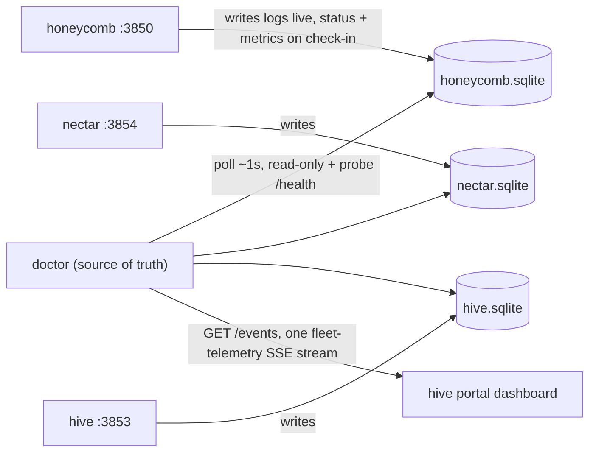

# Telemetry: Doctor As The Single Source Of Truth

> Category: Architecture | Version: 1.1 | Date: July 2026 | Status: Active | Author: Mario Aldayuz

For engineers touching the poll loop, the SQLite reader, the SSE producer, or any service-side telemetry writer: this is the ADR-0001/ADR-0002 pipeline, the three pinned contracts, and the shipped wiring of every piece. The doctor-side program (PRD-001, PRD-002) is shipped, verified, and running in live installs.

**Related:**
- [system-overview.md](./system-overview.md)
- [supervision-and-remediation.md](./supervision-and-remediation.md)
- [../telemetry/telemetry-ingestion-pipeline.md](../telemetry/telemetry-ingestion-pipeline.md)
- [../telemetry/sse-producer.md](../telemetry/sse-producer.md)
- [../telemetry/outbound-telemetry-and-privacy.md](../telemetry/outbound-telemetry-and-privacy.md)
- [../data/registry-and-state.md](../data/registry-and-state.md)
- [../security/trust-boundaries.md](../security/trust-boundaries.md)
- [ADR-0001-hive-telemetry-transport-and-single-source-of-truth.md](./ADR-0001-hive-telemetry-transport-and-single-source-of-truth.md)
---

## The shape of the pipeline

The hive portal needs live fleet health, metrics, and logs in near real time. A dying service cannot reliably push "I am crashing" before it dies, so push channels from services are exactly the wrong transport for the failure that matters most. ADR-0001 settles the flow in one sentence: **services write to SQLite; doctor polls and owns the truth; one SSE stream feeds the portal.**



Each service writes its own non-sensitive telemetry to its own local SQLite database in WAL mode: log rows live, status and metric check-ins on an interval. Doctor opens each database strictly read-only through `node:sqlite` (`DatabaseSync` with `readOnly: true`, 1s busy timeout), polls roughly once per second, probes each `/health`, and merges everything into one in-memory fleet model. Exactly one SSE stream carries that model to hive. There is no service-to-doctor stream and no second streaming surface anywhere in `src/`.

A crashed service simply stops updating its rows and stops answering `/health`; doctor notices within about one poll interval. No lost dying gasp required.

## Contract A: the extended registry entry

Pinned in the-apiary's `library/ledger/EXECUTION_LEDGER.md` before any Wave-1 code was written, so honeycomb, nectar, and hive could build writers in parallel. One new optional field on the existing `DaemonEntry`:

```json
{
  "name": "honeycomb",
  "healthUrl": "http://127.0.0.1:3850/health",
  "pidPath": "~/.honeycomb/daemon.pid",
  "probeIntervalMs": 30000,
  "startupGraceMs": 60000,
  "restartGiveUpThreshold": 3,
  "restartCooldownMs": 5000,
  "telemetryDbPath": "~/.honeycomb/telemetry/honeycomb.sqlite"
}
```

`telemetryDbPath` is optional and tilde-expanded like `pidPath`. Absent means health-probe-only: the poll loop skips SQLite ingestion for that entry and every legacy PRD-004a behavior is preserved exactly. The coercion in `src/registry.ts` also enforces containment: the resolved path must be absolute and must live under `~/.honeycomb/telemetry/` (`assertWithinBase`), else it degrades to absent. That containment is a security fix, not a convenience; see [../security/trust-boundaries.md](../security/trust-boundaries.md).

## Contract B: the runtime SQLite schema

Each service's telemetry database carries three tables. Doctor never creates or writes any of them; creation and writes are each service's job in its own repo (honeycomb PRD-071, nectar PRD-017). The pinned DDL:

```sql
CREATE TABLE IF NOT EXISTS service_status (
  id INTEGER PRIMARY KEY CHECK (id = 1),
  name TEXT NOT NULL,
  binding_time TEXT NOT NULL,       -- ISO-8601, set once at process start
  last_seen TEXT NOT NULL,          -- ISO-8601, updated every heartbeat
  health TEXT NOT NULL,             -- 'ok' | 'degraded' | 'unconfigured'
  deeplake_connected INTEGER,       -- 0/1, nullable
  deeplake_last_comm TEXT           -- ISO-8601, nullable
);

-- honeycomb's metric set (3 counters)
CREATE TABLE IF NOT EXISTS service_metrics (
  id INTEGER PRIMARY KEY CHECK (id = 1),
  actions_taken INTEGER NOT NULL DEFAULT 0,
  files_processed INTEGER NOT NULL DEFAULT 0,
  memories_created INTEGER NOT NULL DEFAULT 0,
  updated_at TEXT NOT NULL
);

-- nectar's metric set (5 counters; own table variant, additive per PRD-002b-AC-4)
CREATE TABLE IF NOT EXISTS service_metrics (
  id INTEGER PRIMARY KEY CHECK (id = 1),
  files_registered INTEGER NOT NULL DEFAULT 0,
  nectars_minted INTEGER NOT NULL DEFAULT 0,
  descriptions_generated INTEGER NOT NULL DEFAULT 0,
  hive_graph_versions INTEGER NOT NULL DEFAULT 0,
  embeddings_computed INTEGER NOT NULL DEFAULT 0,
  updated_at TEXT NOT NULL
);

CREATE TABLE IF NOT EXISTS service_logs (
  id INTEGER PRIMARY KEY AUTOINCREMENT,
  ts TEXT NOT NULL,
  level TEXT NOT NULL CHECK (level IN ('error','warn','info','debug')),
  message TEXT NOT NULL
);
CREATE INDEX IF NOT EXISTS idx_service_logs_ts ON service_logs(ts DESC);
```

The rules that ride with the DDL: `service_status` and `service_metrics` are single-row (`id = 1`) latest-wins tables, updated in place. `service_logs` is append-only but writer-rotated at a 5,000-row cap (oldest rows deleted past the cap). Metrics reset to zero on process start (a new `binding_time` anchors "since last restart"). Nothing sensitive ever lands in a column: no tokens, credentials, memory bodies, source content, or PII. Doctor opens every service DB read-only.

Doctor's reader is deliberately schema-tolerant: `parseMetricsRow` in `src/telemetry/sqlite-reader.ts` forwards every `service_metrics` column except the bookkeeping `id`/`updated_at`, camelCased, so honeycomb's 3-counter and nectar's 5-counter variants both work with zero doctor code changes, and a service adding a counter needs none either (additive evolution, PRD-002b b-AC-4).

## Contract C: the fleet-telemetry SSE event

One stream at `GET http://127.0.0.1:3852/events` (loopback only), `text/event-stream`, one event type, `fleet-telemetry`, emitted once per poll tick:

```json
{
  "asOf": "2026-07-01T18:00:00.000Z",
  "services": [
    {
      "name": "honeycomb",
      "health": "ok",
      "lastSeen": "2026-07-01T17:59:59.500Z",
      "metrics": { "actionsTaken": 12, "filesProcessed": 3, "memoriesCreated": 5 },
      "deeplake": { "connected": true, "lastCommunicationAt": "2026-07-01T17:59:50.000Z" }
    }
  ],
  "logs": [{ "service": "honeycomb", "ts": "2026-07-01T17:59:59.400Z", "level": "info", "message": "..." }]
}
```

Semantics the portal can rely on: a never-registered service is absent from `services`; a registered-but-silent one appears with `health: "unknown"`. `logs` is a bounded slice of only the rows written since the previous tick (default window 200 rows per service per tick), never a history, so both doctor and the portal stay memory-bounded no matter how much a service has logged. The in-code shape is `FleetTelemetryEvent` in `src/telemetry/schema.ts`, which adds one field beyond the pinned example: `telemetryFault`, non-null when that service's DB was skipped this tick (`"missing" | "locked" | "malformed" | "read-error"`). Hive's `GET /api/fleet-status` REST projection remains the fail-soft fallback when the stream is unavailable.

## How the merge decides health

`pollEntry` in `src/ingestion/poll-loop.ts` merges three signals into one `FleetHealth` per service:

- Probe `unreachable` wins outright; probe `degraded` is next.
- Probe `ok` but a stale `last_seen` (older than 3x the entry's `probeIntervalMs` by default) means the service answers HTTP but stopped checking in to its own telemetry: reported `degraded` rather than a stale `ok`.
- A `service_status` row whose `name` does not match the registry entry is treated as malformed and rejected before any row is cached or forwarded, so a mispointed `telemetryDbPath` can never cross-wire one service's telemetry onto another.
- A disconnect is not a deletion: the static entry stays, `lastSeen` simply stops advancing (ADR-0002 decision 3). There is no separate `disconnectedAt` field.

Faults are isolated per service (PRD-001c c-AC-6): a missing, locked, or malformed DB closes and drops that entry's handle (so the next tick retries fresh), degrades that one service to its probe signal plus its last known telemetry with `telemetryFault` set, and every other service keeps polling normally. A slow or dead SSE consumer is dropped rather than buffered without bound (`safeWrite` in `src/ingestion/sse.ts`); one bad connection never touches another or the loop.

## Shipped wiring, per module

- **Registry `telemetryDbPath` parse + containment (`src/registry.ts`):** implemented, tested, live in the boot path.
- **Read-only SQLite reader (`src/telemetry/sqlite-reader.ts`):** implemented and tested (windowed cursor reads, schema-tolerant metrics, read-only enforcement proven by test).
- **Poll-and-merge loop (`src/ingestion/poll-loop.ts`):** implemented, tested, and composed. `createDoctor()` builds `telemetryPollLoop` over the same resolved registry the supervisors use and arms it in `start()` (`src/compose/index.ts`).
- **SSE producer (`src/ingestion/sse.ts`):** implemented, tested, and mounted at `GET /events` on the existing `:3852` status page via the `onEvents` seam. When the seam is not wired (a bare `createStatusPageServer` without `onEvents`), `/events` 404s like any unknown path; the production composition wires it.
- **Service-side writers (Contract B creation, check-ins, log taps, 5,000-row rotation):** each service's own repo. Honeycomb PRD-071 and nectar PRD-017 own the writer-hygiene and retention ACs (001b-AC-4, 002b-AC-5, 002c-AC-3/AC-5), because doctor deliberately cannot implement or enforce another process's writes; doctor consumes whatever a service writes and degrades cleanly to health-probe-only when a service has no telemetry DB. **Status: shipped in the honeycomb and nectar repos; consumed here.**
- **Installer registration (writing `telemetryDbPath` into real installs' registries):** the installer's job per the-apiary ADR-0002, by design not doctor's. A registry without the field degrades cleanly to health-probe-only. **Status: owned by the-apiary installer pipeline.**
- **Doctor's own PRD-001/PRD-002 program** is shipped and its doctor-side ACs are verified in the-apiary execution ledger. The ingestion pipeline, containment, poll-and-merge loop, and SSE producer above are all live in the boot path.

## Boundaries worth restating

The telemetry pipeline and the supervision pipeline share the registry and nothing else. A telemetry fault never influences restart or escalation decisions, and a remediation in flight never blocks a poll tick. Both loops stop cleanly: `stop()` disarms them and `telemetryPollLoop.close()` releases every SQLite handle so a stopped watchdog never holds a service's database file open.
