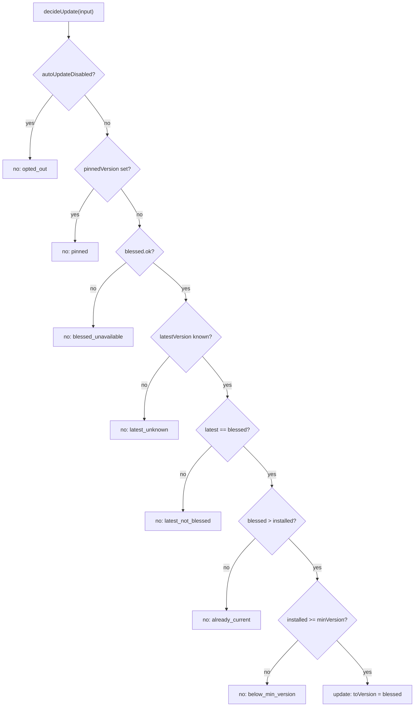

# Auto-Update Engine

> Category: Operations | Version: 1.0 | Date: July 2026 | Status: Active | Author: Mario Aldayuz

For engineers working on `src/update/`: this is the blessed-channel gate, the pure update decision, the verify-and-rollback transaction, the jittered poll cadence, and how installed-version and blessed-version resolution keep a bad publish from spreading across the fleet.

**Related:**
- [status-page-and-cli.md](./status-page-and-cli.md)
- [cli-deep-dive.md](./cli-deep-dive.md)
- [../infrastructure/build-and-release.md](../infrastructure/build-and-release.md)
- [../architecture/composition-root.md](../architecture/composition-root.md)
- [../security/trust-boundaries.md](../security/trust-boundaries.md)
- [outbound-telemetry-and-privacy.md](../telemetry/outbound-telemetry-and-privacy.md)
---

## The problem: a 30-minute blast radius

Doctor keeps the primary daemon (`@legioncodeinc/honeycomb`) current so a fleet does not drift onto stale, buggy versions. But naive auto-update against npm `@latest` is dangerous: a 30-minute poll against raw `@latest` would fan a bad publish across every install in half an hour. So updates are gated on a blessed version, verified after install, and rolled back on a failed verify. A bad release that never gets blessed never auto-installs, and a blessed-but-broken one recovers on the version that worked.

Doctor never auto-updates itself. The engine is hard-wired to `PRIMARY_PACKAGE = "@legioncodeinc/honeycomb"` at the composition root; `doctor self-update` is the only code path that touches `@legioncodeinc/doctor`, and it runs only when a human types the verb. See [../architecture/composition-root.md](../architecture/composition-root.md).

## The blessed channel is fail-closed

`fetchBlessedVersion` in `src/update/blessed-channel.ts` reads a static object from the install CDN:

```typescript
export const DEFAULT_BLESSED_URL = "https://get.theapiary.sh/blessed-version.json";
export const DEFAULT_BLESSED_TIMEOUT_MS = 5_000;
```

It resolves a discriminated result: `{ ok: true, manifest }` on a positively-parsed body, or `{ ok: false, reason }` where reason is `"unreachable" | "non_2xx" | "unparseable"`. The manifest shape is `{ version: string; minVersion?: string }`, hand-validated by `parseBlessedManifest` (reject null, non-object, non-string version, or empty-after-trim). The function is fail-closed by construction: an unreachable CDN, a non-2xx status, a timeout, or an unparseable body all resolve to a failure, and a failure means "stay on the current version". Fetching the channel can never trigger an update; only a positively-parsed blessed version can. The CI bless step flips this object only after canary and smoke health pass, so the channel is the gate the whole safety property hangs on.

## The decision is pure

`decideUpdate` in `src/update/update-policy.ts` is a pure gate with no I/O: all inputs are pre-resolved by the engine, so the decision is unit-testable without any seam. It runs a fixed sequence of checks and returns either `{ update: true, toVersion }` (always the blessed version, never raw `@latest`) or `{ update: false, reason }`:



The `latest == blessed` requirement is deliberate: doctor only forward-updates when npm's `@latest` has caught up to the blessed version, so the two independent signals must agree before any install runs. Version comparison uses a dependency-free strict SemVer 2.0.0 implementation in `src/update/version.ts` (`parseVersion`, `compareParsed`, `isStrictlyNewer`, `isSameVersion`), fail-closed: an unparseable version is treated as "not newer" and can never trigger an update.

## The transaction: install, restart, verify, rollback

`runUpdateTransaction` in `src/update/update-engine.ts` approximates atomicity the only way npm allows. The sequence:

1. **Gather the decision.** Read installed, latest, and blessed; run `decideUpdate`. A no-go returns `no_update` with the reason. An installed version of `null` returns `installed_unknown`.
2. **Capture the pre-update health baseline** (`wasHealthyBefore = await verifyHealthy()`). This is what the rollback decision keys off.
3. **Acquire the shared install lock.** If held (rung 2's reinstall is running), return `skipped_lock_held`. This is the serialization that keeps two `npm i -g` operations from interleaving.
4. **Install the blessed version.** `installVersion` validates the version as strict SemVer before composing the npm spec, then runs `npm install -g @legioncodeinc/honeycomb@<blessed>` pinned to the exact version. A failed install returns `install_failed`.
5. **Restart the daemon** through the injected `restartDaemon` seam and record whether the restart actually happened.
6. **Verify `/health`.** Healthy means the update took: return `updated`.
7. **On a failed verify, decide rollback.** If the daemon was healthy before AND the restart was supervised, a healthy-to-unhealthy regression is a real failure: roll back to the recorded prior version, restart, re-verify, and return `rolled_back` (or `rollback_failed` if recovery did not take). Otherwise the daemon was already down, or there was no OS service to restart through, so the update cannot have made it worse: return `updated_unverified` without rolling back.

The install lock is always released in a `finally`, and the whole transaction is wrapped so any unexpected throw becomes `install_failed`.

## The seven outcomes

`UpdateTransactionStatus` is a closed union of seven values. Every transaction resolves exactly one, and the observable ones feed telemetry so fleet rollout health is measurable:

| Status | Meaning |
|---|---|
| `updated` | Installed and verified healthy on the new version |
| `updated_unverified` | Installed and kept; no healthy baseline or no supervised daemon to verify against |
| `rolled_back` | Post-update health failed; recovered on the prior version |
| `rollback_failed` | Post-update health failed AND the rollback did not recover |
| `install_failed` | The npm install itself failed |
| `no_update` | The gate declined (opt-out, pin, not blessed, already current, or a fail-closed read) |
| `skipped_lock_held` | Another installer (rung 2) held the shared lock |

## Reading versions the right way

Two "version" reads feed the engine, and they mean different things:

- **The globally-installed package version** comes from `createInstalledPackageVersionReader` (`src/update/installed-version.ts`), which runs `npm ls -g <pkg> --depth=0 --json` and parses `dependencies[pkg].version`. It deliberately does not gate parse on `result.ok`, because `npm ls` exits non-zero on tree warnings while still printing valid JSON. This is what the engine and rung 2 mean by "installed": it is on disk even when the daemon is down, so auto-update can establish a rollback target and repair a dead daemon.
- **The daemon's reported version** comes from `readDaemonVersion` (`src/cli/daemon-version.ts`) over `/health`. This is used for display and the install-health snapshot, and it is `null` when the daemon is down. It is deliberately not what the engine trusts for the install decision.

The npm-registry `@latest` read is `createRegistryLatestReader` (`src/update/registry.ts`), which reads `https://registry.npmjs.org/<pkg>/latest` and is fail-soft: any transport error, non-2xx, or unparseable body yields `null`, which the gate reads as `latest_unknown` and declines.

## The poll cadence

`createUpdatePollLoop` in `src/update/poll-loop.ts` drives the transaction on a schedule:

```typescript
export const DEFAULT_POLL_INTERVAL_MS = 30 * 60 * 1000; // 30 minutes
export const DEFAULT_JITTER_FRACTION = 0.1;             // +/- 10%
```

The loop sleeps a jittered delay first, so boot never stampedes an update: the first poll lands roughly 30 minutes after start, spread by up to plus or minus 10 percent so a fleet does not hit npm or the CDN in lockstep. When auto-update is disabled, the loop never ticks at all: `start()` logs and returns immediately, no timer is ever armed, and a disabled box does zero registry and CDN polling. The disabled decision comes from `resolveOptOut` (`src/cli/opt-out.ts`), whose precedence is CLI flag, then `HONEYCOMB_NO_AUTO_UPDATE` env, then persisted state, then a pin at any layer. Any pin disables forward motion. The `source` field on the resolved opt-out is what `doctor status` prints so an operator sees which layer made the decision.

## Update telemetry

Every update and rollback emits a telemetry event (`src/update/update-telemetry.ts`, `UpdateTelemetryEvent` with `kind: "update" | "rollback"`, from/to versions, and an outcome). The default emit adapts the event onto the shared 064d chokepoint (`emit.ts`) as an error-stream log, and, for a successful update, additionally fires the `doctor_updated` PostHog capture event (deduped per target version via the lifecycle store). Both legs honor the opt-out gates; the emit never throws. The details of the chokepoint, the allow-list, and the opt-out gates are in [outbound-telemetry-and-privacy.md](../telemetry/outbound-telemetry-and-privacy.md).

## How an operator drives it

Auto-update is autonomous behind the poll loop, but the CLI exposes the same engine:

- `doctor update --check` runs `previewUpdate()`: it reads installed, latest, and blessed and runs the same gate, mutating nothing (no lock, no npm, no restart). It prints whether an update is available and, if not, the reason.
- `doctor update` runs the full transaction once.
- `doctor status` shows the current auto-update opt-out state and its source.

The CLI mapping (`createUpdateActions` in `src/cli/update-actions.ts`) enforces that `--check` is read-only: it calls `previewUpdate()` and never `runUpdateTransaction()`. The CLI verb table and exit codes are in [cli-deep-dive.md](./cli-deep-dive.md). The bless step, the release pipeline, and how the blessed object gets flipped are in [../infrastructure/build-and-release.md](../infrastructure/build-and-release.md).

## Invariants for contributors

- The blessed channel stays fail-closed. Any read failure means "stay on the current version".
- `decideUpdate` stays pure. New conditions are checks with pre-resolved inputs, not I/O.
- Every version composed into an npm spec is strict-SemVer validated first. A spoofed `/health` version must never smuggle `latest` or a range into npm.
- "Installed" for the update decision is the globally-installed package version, not `/health`.
- The rollback rule holds: only a healthy-before, supervised-restart, unhealthy-after transition rolls back. An already-down daemon is never rolled back.
- A disabled loop arms no timer. The opt-out is checked in both the loop and the engine.
- The engine stays hard-wired to the primary package. Nothing here installs doctor's own package.
