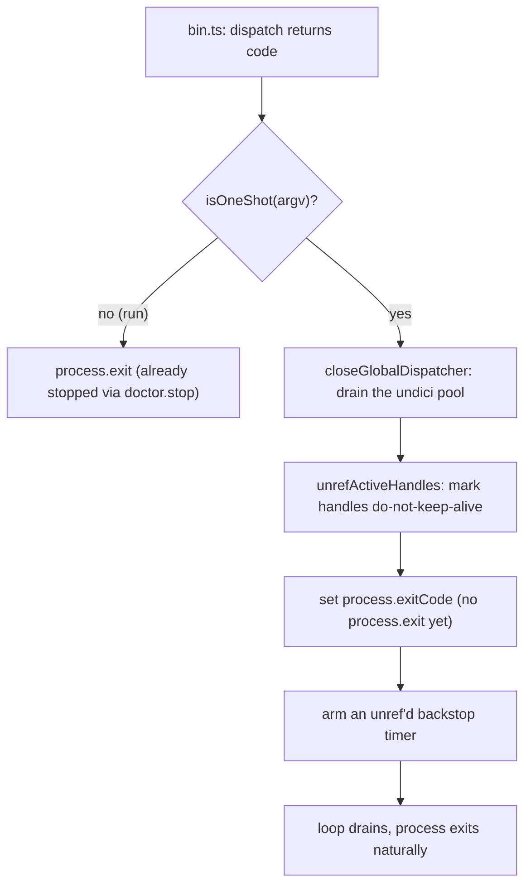

# CLI Deep Dive

> Category: Operations | Version: 1.0 | Date: July 2026 | Status: Active | Author: Mario Aldayuz

For engineers working on `src/cli/`: this is the CLI's anatomy below the verb table, the single-sourced command surface, the hand-rolled argument parser, the hermetic context, the exit-code discipline, and the Windows shutdown fix that keeps one-shot commands from tripping a libuv assertion.

**Related:**
- [status-page-and-cli.md](./status-page-and-cli.md)
- [auto-update-engine.md](./auto-update-engine.md)
- [escalation-and-needs-attention.md](./escalation-and-needs-attention.md)
- [../architecture/composition-root.md](../architecture/composition-root.md)
- [../standards/zero-dependency-engineering.md](../standards/zero-dependency-engineering.md)
---

## Scope: the machinery, not the runbook

The operator-facing verb table, env vars, and troubleshooting live in [status-page-and-cli.md](./status-page-and-cli.md). This doc is the engineer's view of how the CLI is built: how verbs are single-sourced, parsed, dispatched, and gated; what the injected context carries; and the two exit paths (one-shot versus the long-running watchdog). The CLI is a hand-rolled dispatcher over a closed command set, with zero CLI-framework dependency, because doctor's first design principle forbids runtime npm dependencies even in the CLI.

## The command surface is single-sourced

`src/cli/command-table.ts` is the one place the verb set is defined. `CommandName` is a closed union, `COMMAND_MENU` is the display-ordered list, `KNOWN_COMMANDS` is the derived membership set, and `resolveCommand` maps a raw token to a `CommandName` or `null`. The menu rendered by `doctor help` and the dispatch switch both read this one source, so a verb cannot exist in one place and not the other.

Two rulings are encoded structurally in the table. There is no `clear-credentials` verb, deliberately: the deferred credential action is recommendable but never runnable, so it has no command. And `self-update` is the only verb that updates doctor's own package; every other update path targets the primary daemon.

## The argument parser is minimal

`parseArgs` in `src/cli/arg-parse.ts` is a hand-rolled argv parser (no yargs, no commander). It resolves a `ParsedArgs`:

```typescript
export interface ParsedArgs {
	readonly command: string | undefined;
	readonly flags: Readonly<Record<string, string | boolean>>;
	readonly positionals: readonly string[];
}
```

The rules are small: a bare `--flag` is a boolean true, `--key=value` and `--key value` both bind a value, the first non-flag token is the command, and the rest are positionals. The flags the dispatcher reads are `--yes` (bypass a confirm gate), `--check` (`update --check` preview), `--lines <n>` and `--daemon <name>` (for `logs`), `--no-auto-update` (the highest-precedence auto-update opt-out), and `--version` / `-v` / `-V` (print the build-injected version and exit).

## Dispatch and exit codes

`dispatch` in `src/cli/dispatch.ts` routes a parsed command to its handler through an exhaustiveness-guarded switch and produces one of three exit codes:

```typescript
export const EXIT_OK = 0;       // command succeeded
export const EXIT_ERROR = 1;    // handler threw or the operation failed
export const EXIT_DECLINED = 2; // user declined a gated confirmation
```

The flow: parse argv, handle `--version` early, render the banner and menu on a bare invocation, error on an unknown command, otherwise route to the handler. Every handler runs inside the dispatcher's crash-safe catch: a handler throw is reported on stderr and mapped to `EXIT_ERROR`, never a stack-trace crash. The `EXIT_DECLINED` code is what a script keys off to distinguish "you said no at the confirm prompt" from "the command failed".

### Gating: which verbs confirm

The repair verbs are gated by risk, and the gating is uniform:

| Verb | Rung | Gate |
|---|---|---|
| `restart` | 1 | ungated (rung 1 is the safe repair) |
| `heal` | decided | rung >= 2 confirms unless `--yes` |
| `reinstall` | 2 | confirms unless `--yes` |
| `uninstall-hivemind` | 3 | always confirms; `--yes` bypasses |
| `diagnose` | (none) | takes no action; consults pure `decide()` only |

`diagnose` is the one that must never act: it consults the pure `decide()` to show the recommended rung and never calls `ladder.run`. That purity is why the CLI can preview a decision on a sick box without risking a repair.

## The hermetic context

Every handler runs against a `CliContext`, and the point of it is that nothing in a handler touches a real process stream, a real prompt, or a real dependency directly. `CliContext` bundles an `OutputSink` (stdout/stderr), a `ConfirmFn` (the prompt), a `Colors` surface, and a `CliDeps` bag of injected collaborators: the probe, the per-daemon status sources, the daemon-version reader, the remediation ladder, the pure `decideRung`, the status-state reader, the service state (sync fallback plus a bounded async probe), the resolved opt-out, the update actions, the incident tailer, the optional service module, and the lifecycle telemetry emitter. In production `buildCliContext` (`src/cli/index.ts`) wires all of these lazily; in tests the whole context is a recorder, so a test can assert exactly which deps a verb called and capture its output without spawning a process.

Lazy assembly is deliberate. `status` and `diagnose` must work with the daemon down, so `buildCliContext` constructs the probe, ladder, and update engine directly rather than spinning the full composition supervisor. Every read seam (probe, version, status state) resolves a value even when the daemon is unreachable, so a one-shot command never throws on a dead daemon.

## Two exit paths: one-shot versus the watchdog

`runCli` in `src/cli/index.ts` splits on the first argument. `run` is the long-running OS-service entry: it calls `runWatchdog`, which builds the full `createDoctor()` assembly, arms it, keeps the process alive, and blocks until SIGTERM or SIGINT drives a graceful `doctor.stop()`. Every other verb is a one-shot: build the context, dispatch, return the code.

The one-shot exit path has a real hazard, fixed in `src/cli/shutdown.ts`. One-shot commands (`status`, `diagnose`, `update --check`, `logs`, `self-update`) do network I/O through the global `fetch` (undici), which leaves keep-alive sockets and a pool timer open. A bare `process.exit()` on the fast path races a closing handle and trips the Windows libuv assertion `!(handle->flags & UV_HANDLE_CLOSING)`. `finalizeOneShot` fixes it at the root:



The fix closes the fetch pool (the root cause), unrefs lingering handles so nothing keeps the loop alive (without destroying them, which would create a new closing handle), sets `process.exitCode` rather than calling `process.exit`, and arms a bounded backstop timer that forces exit only if the loop refuses to drain. The long-running `run` path never touches this: it exits through its own graceful `doctor.stop()`.

## The pieces the verbs lean on

- **`banner.ts` / `colors.ts`** are pure string builders. `renderBannerWithMenu` reads `COMMAND_MENU` so the menu never drifts from the table. `createColors` resolves the color decision once: `NO_COLOR` (any non-empty value) forces off, `FORCE_COLOR` forces on, otherwise color is on only for a TTY. When disabled, every color helper is the identity function.
- **`self-update.ts`** builds the sole path that updates `@legioncodeinc/doctor`: `createSelfUpdate` runs `npm install -g @legioncodeinc/doctor@<tag>` through the shared command runner, logs the outcome, and returns a human-readable line. It never runs autonomously; only the `self-update` verb calls it.
- **`update-actions.ts`** maps the update engine onto the three CLI actions and enforces that `checkPrimaryUpdate` is read-only (`previewUpdate` only). See [auto-update-engine.md](./auto-update-engine.md).
- **`opt-out.ts`** centralizes the auto-update opt-out precedence (CLI > env > state > pin) and exposes the `source` field `status` prints.
- **`incidents-tail.ts`** reads the per-daemon incident shards for `logs`. The `--daemon <name>` argument is guarded: only names in the registry are accepted, and an unregistered or path-shaped value is rejected loudly, because the name is interpolated into a filename. Registry names are validated filename-safe at parse time, so membership implies safety.
- **`daemon-version.ts`** reads the daemon's reported version from `/health` over `node:http` (not `fetch`), defensively: any error is `null`, so `status` shows "unknown" rather than throwing when the daemon is down.
- **`service-stub.ts`** owns the `ServiceModule` contract the `install-service` / `uninstall-service` verbs delegate to. When the real service module is not wired, the verb prints a stub message and exits 0; when it is, the verb maps `result.ok` to the exit code and fires the gated, fail-soft lifecycle capture events.

## Invariants for contributors

- The verb set stays single-sourced in `command-table.ts`. A new verb is added there and to the dispatch switch, nowhere else.
- No CLI-framework dependency. `parseArgs` is hand-rolled and stays that way.
- `diagnose` takes no action. It consults the pure `decide()` only.
- Exit codes stay meaningful: 0 ok, 1 error, 2 declined. A gated verb that a user declines returns 2, not 1.
- One-shot commands exit through `finalizeOneShot`. Adding a one-shot verb that does network I/O without this path reintroduces the Windows assertion.
- `self-update` is the only verb that touches doctor's own package. Nothing else installs `@legioncodeinc/doctor`.
