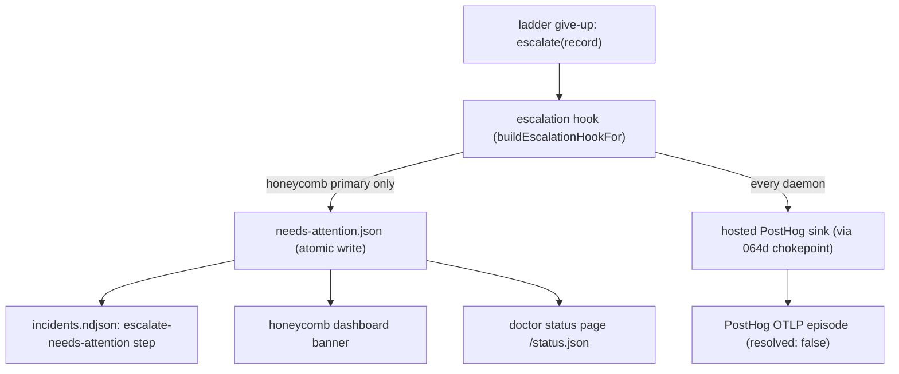

# Escalation And Needs-Attention

> Category: Operations | Version: 1.0 | Date: July 2026 | Status: Active | Author: Mario Aldayuz

For operators reading an escalation and engineers touching `src/escalation/`: this is what doctor does when the ladder runs out, the two stores an escalation lands in, the recommended-action taxonomy, the per-daemon isolation rule, and how you consume it from the CLI and status page.

**Related:**
- [status-page-and-cli.md](./status-page-and-cli.md)
- [cli-deep-dive.md](./cli-deep-dive.md)
- [../architecture/remediation-rungs-deep-dive.md](../architecture/remediation-rungs-deep-dive.md)
- [../architecture/composition-root.md](../architecture/composition-root.md)
- [../data/registry-and-state.md](../data/registry-and-state.md)
- [../security/trust-boundaries.md](../security/trust-boundaries.md)
---

## What escalation is for

Doctor stays silent when things are fine and loud only when it genuinely cannot fix something. Escalation is that loud moment: the numbered remediation rungs could not restore health, so doctor stops climbing and hands a structured diagnosis to a human. The design goal is high signal. A green probe is a debug log line; an unhealable install is a structured report that reaches you on your own machine first, and (unless opted out) at a hosted sink so a problem gets noticed before you file a ticket.

The record doctor produces is the `EscalationRecord` from `src/rungs/escalation.ts`: a plain-language diagnosis, the ordered steps attempted with outcomes, a recommended action, an optional `wouldHaveTaken` note for deferred actions, and a timestamp. How it is built (and the credential non-touch policy that shapes it) is in [../architecture/remediation-rungs-deep-dive.md](../architecture/remediation-rungs-deep-dive.md).

## The recommended-action taxonomy

`RecommendedAction` is a closed union. Each value maps to a specific operator affordance, and the status page renders each one differently:

| `recommendedAction` | Meaning | Status-page suggestion |
|---|---|---|
| `reinstall-primary` | The primary daemon's install is corrupt or stale | `npm install -g @legioncodeinc/honeycomb@latest` |
| `uninstall-conflicting-hivemind` | A conflicting `@deeplake/hivemind` global is present | `npm uninstall -g @deeplake/hivemind` |
| `clear-credentials` | A credential fault is suspected (DEFERRED) | `# Review ~/.deeplake/credentials.json (Doctor cannot clear it automatically)` |
| `investigate` | Something needs a human look | `doctor diagnose` |
| `manual-intervention` | The ladder exhausted; general escalation | `doctor diagnose` |

The `clear-credentials` row is the one that reads differently on purpose. Doctor recommends it but never performs it: there is no credential-purge code path anywhere in the codebase, and the status page renders the recommendation as a shell comment, not a runnable command. When the recommended action is `clear-credentials`, the record also carries a `wouldHaveTaken` note stating exactly what doctor declined to do, so the intent reaches you without the action ever being automated. `buildSuggestedCommands` in `src/status-page/server.ts` is where this mapping lives.

## Two stores, one escalation

When the ladder gives up, the escalation hook the composition root wired lands the record in two places, both fail-soft:



### needs-attention.json, the local read seam

`createNeedsAttentionStore` in `src/escalation/needs-attention-store.ts` persists the latest escalation to `needs-attention.json` in doctor's workspace. This is the dashboard read seam: doctor writes it, the honeycomb dashboard and doctor's own status page read it, and the dependency is strictly one-directional. The file shape is versioned:

```typescript
export interface NeedsAttentionFile {
	readonly version: 1;
	readonly escalation: EscalationRecord;
	readonly resolved: boolean;
	readonly recordedAt: string;
	readonly resolvedAt?: string;
}
```

`record()` does two writes. First it writes `needs-attention.json` atomically (serialize to a random-suffixed temp file, then `renameSync` over the target, so a crash mid-write never leaves a half-written file). Second it appends an `escalate-needs-attention` step to `incidents.ndjson`, so the escalation survives even when a later escalation overwrites `needs-attention.json`. Both writes are defensive: a containment violation or I/O failure is logged (`needs-attention.write_failed`) and swallowed, never thrown. `resolve()` marks the current record `resolved: true` with a `resolvedAt` timestamp so the dashboard banner clears once a later heal cycle restores health; it is idempotent (a second resolve, or a resolve with no record, is a logged no-op).

### The hosted sink

`emitEscalationToHostedSink` in `src/escalation/hosted-sink.ts` routes the same escalation to PostHog through the shared 064d telemetry chokepoint (`emit.ts`). It does not invent a new OTLP stream; it synthesizes a minimal `Incident` from the escalation record (trigger `unknown`, `resolved: false`, carrying the escalation's steps) and emits it as an episode, so PostHog can alert on a give-up. It is fire-and-forget and fail-soft: a network failure or an empty key is logged at warn (`hosted-sink.escalation_not_sent`) but never thrown, and it never rejects. The sink honors the same opt-out gates as every other outbound telemetry path (see [../security/trust-boundaries.md](../security/trust-boundaries.md)).

## The per-daemon isolation rule

The two-store split has one subtle rule the composition root enforces: only the honeycomb primary writes the shared `needs-attention.json`. Every other daemon's escalation is durable in its own `incidents-<name>.ndjson` shard instead. The reason is that `needs-attention.json` is a single shared file backing the honeycomb dashboard banner and the "honeycomb" row on the status page. If nectar giving up wrote that same file, it would silently overwrite honeycomb's escalation record and pollute honeycomb's banner.

So the escalation hook checks the entry name (`buildEscalationHookFor` in `src/compose/index.ts`): the honeycomb hook calls `needsAttention.record()`; every other daemon's hook does not. For the status-page row, a non-primary daemon's escalation is reconstructed from its incident shard by `readPerDaemonEscalation`, which walks the shard backward, finds the most recent `escalate` or `escalate-needs-attention` step, and projects it into a `NeedsAttentionFile` shape. The hosted sink, in contrast, fires for every daemon: a give-up on any daemon is signal worth having remotely.

## How an operator consumes it

**On the status page.** Open `http://127.0.0.1:3852`. The HTML page shows a per-daemon table with an escalation column ("needs attention" or "none") and the latest escalation as pretty-printed JSON, followed by suggested commands derived from the recommended action. The machine-readable projection is at `/status.json`, whose `daemons[].escalation` and top-level `escalation` fields carry the full `NeedsAttentionFile` per daemon. All dynamic strings are HTML-entity escaped, so a hostile daemon name or escalation text cannot inject into the local page.

**On the CLI.** `doctor logs` tails the incident episodes; `doctor logs --daemon <name>` filters to one daemon's shard, which is where a non-primary daemon's escalation lives. `doctor status` shows each daemon's coarse health, so an escalation shows up as a non-ok row you then drill into with `logs`. The full CLI surface is in [cli-deep-dive.md](./cli-deep-dive.md).

**The read discipline.** A missing `needs-attention.json` means "no escalation has occurred" and is not an error. Readers must check `version` and tolerate unknown fields, since the file is a forward-compatible contract. The complete on-disk schemas for `needs-attention.json`, `incidents.ndjson`, and `removed-packages.ndjson` are in [../data/registry-and-state.md](../data/registry-and-state.md).

## Runbook: reading an escalation end to end

1. The status page shows a daemon `unreachable` with "needs attention". The top-level escalation JSON (or `~/.honeycomb/doctor/needs-attention.json`) carries `escalation.diagnosis` and `escalation.steps`.
2. Read `diagnosis`: it states in plain language why the ladder could not heal (for example, "numbered remediation exhausted (rung 2 npm-exit-1)").
3. Read `steps`: the ordered attempts with outcomes (`succeeded` / `failed` / `skipped`) show how far the ladder got.
4. Read `recommendedAction` and run the matching suggested command from the page. If it is `clear-credentials`, review `~/.deeplake/credentials.json` yourself; doctor will not, and the `wouldHaveTaken` note tells you exactly what it wanted to do.
5. Once you fix the root cause, the next healthy probe cycle resolves the escalation and the banner clears (`resolve()` sets `resolved: true`).

## Invariants for contributors

- `record()` and `resolve()` never throw. Both writes degrade to a logged failure.
- Only the honeycomb primary writes `needs-attention.json`. A new daemon's escalation stays in its own incident shard.
- The hosted sink fires for every daemon and honors the opt-out gates through the shared chokepoint.
- `clear-credentials` stays deferred: recommended, `wouldHaveTaken`-noted, never executed, rendered as a comment.
- The needs-attention file is a versioned forward-compatible contract. Readers check `version` and tolerate unknown fields.
