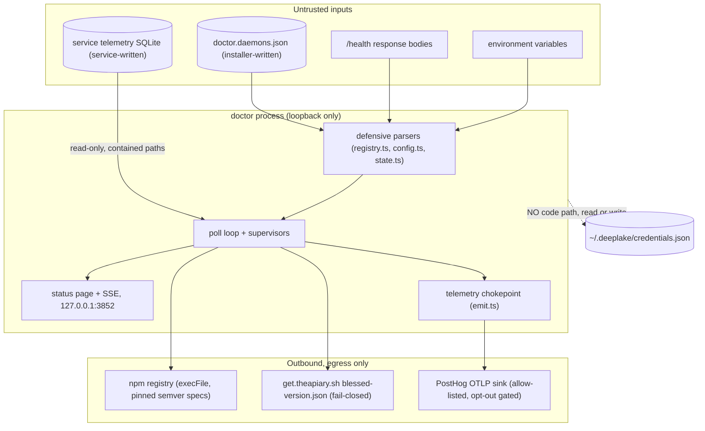

# Trust Boundaries

> Category: Security | Version: 1.0 | Date: July 2026 | Status: Active | Author: Mario Aldayuz

The security model: what doctor exposes, what it refuses to trust, the attack the telemetryDbPath containment closes, the credential non-touch policy, and exactly what leaves the box over telemetry.

**Related:**
- [../architecture/system-overview.md](../architecture/system-overview.md)
- [../architecture/telemetry-single-source-of-truth.md](../architecture/telemetry-single-source-of-truth.md)
- [../data/registry-and-state.md](../data/registry-and-state.md)
- [../infrastructure/build-and-release.md](../infrastructure/build-and-release.md)
- [../architecture/ADR-0001-hive-telemetry-transport-and-single-source-of-truth.md](../architecture/ADR-0001-hive-telemetry-transport-and-single-source-of-truth.md)
---

## The boundary map

## Loopback-only surfaces

Doctor's entire inbound surface is one HTTP listener bound to `127.0.0.1` on `:3852` (`LOOPBACK` constant in `src/status-page/server.ts`), serving `GET /`, `GET /status.json`, and the `GET /events` SSE stream. It is read-only by construction: no route mutates anything, proxies anything, or triggers an action. There is no MCP server, no SDK, no remote management port, and no 0.0.0.0 bind anywhere. All dynamic strings on the HTML page are entity-escaped (`escapeHtml`), so even hostile daemon names or escalation text cannot inject into the local page.

The outbound directions are equally narrow: `/health` probes to loopback daemons, `npm` invocations through `execFile`, the blessed-version CDN fetch, and the PostHog telemetry POST. That is the complete network story.

## The registry is untrusted installer-written input

`~/.honeycomb/doctor.daemons.json` is an external file another process writes, so `src/registry.ts` validates it at the boundary like it came from the internet:

**SSRF gate on `healthUrl`.** Doctor fetches every entry's `healthUrl` on a timer and reflects reachability on the status page. A tampered registry with a non-loopback URL would turn the watchdog into a server-side request forgery primitive: attacker-chosen origins fetched from the user's machine on a schedule. `coerceHealthUrl` therefore requires http/https AND a hostname on the loopback allow-list (`127.0.0.1`, `localhost`, `::1`, `[::1]`); anything else silently falls back to the safe loopback default, mirroring hive's `isLoopbackBaseUrl` gate so both watchdog surfaces share one loopback-trust model.

**Containment on `telemetryDbPath`.** This is the fix landed in commit `ad2174a` off the security review of the telemetry ingestion work. The attack it closes: an unconstrained `telemetryDbPath` lets a poisoned registry point doctor's poller at ANY user-readable SQLite file. Doctor opens it read-only, sure, but if the file happens to carry Contract-B-shaped tables, its contents get polled and forwarded over the unauthenticated loopback `/events` stream, turning the watchdog into a local file-exfiltration relay. `coerceTelemetryDbPath` closes it: the value is tilde-expanded, rejected unless absolute (a relative path would anchor to whatever cwd the process has, so a parse-time check could validate one file and the poll loop could open another), resolved, and asserted to sit under `~/.honeycomb/telemetry/` via `assertWithinBase`, which returns the exact candidate it checked so nothing downstream can reinterpret it. An escaping path degrades to absent (health-probe-only), never a crash and never a silently honored escape. Downstream, the poll loop adds a second check: a `service_status.name` that does not match the registry entry's name is treated as a malformed DB and isolated before any row is cached or forwarded, so a mispointed path cannot cross-wire one service's telemetry onto another.

**Fail postures.** A missing file falls back to the honeycomb primary. A malformed file fails loudly at parse (`RegistryError`) but is caught at the composition root, which falls back, logs, and records a needs-attention record instead of handing the OS supervisor a crash loop.

Doctor's own state files get the same treatment in the other direction: every fixed filename is joined under the workspace dir through `resolveInBase`/`assertWithinBase` (`src/safe-path.ts`), so no composed write can land outside `~/.honeycomb/doctor`.

## Command execution hygiene

Every shell-out (npm installs, service managers, detection probes) goes through `createExecFileRunner` (`src/rungs/command-runner.ts`): `execFile` with argv arrays and no shell, so a path or label can never be re-parsed as a metacharacter. The update engine adds npm-spec hygiene on top: any version string headed into `npm install -g <pkg>@<version>` is validated as strict semver first, because the rollback path's version once came from a network-sourced `/health` body and a spoofed `latest` or `>=0.0.0` range must never reach npm's resolver. The shared install lock serializes rung 2's reinstall against the auto-update engine so two global installs can never interleave.

## The credential non-touch policy

Doctor never reads, writes, or deletes `~/.deeplake/credentials.json`. This is enforced by absence: there is no credential-purge code path in the codebase, no `clear-credentials` CLI verb in the command table (deliberately, AC-064f.4), and rung 3's only filesystem write is the backup record under doctor's own workspace. When doctor suspects a credential fault it escalates with `recommendedAction: "clear-credentials"` and a `wouldHaveTaken` note ("would clear ~/.deeplake/credentials.json (DEFERRED - not performed in v1)"), so the recommendation reaches a human without the action ever being automated. The status page renders that recommendation as a comment, not a command.

The same boundary shapes rung 3: removing a conflicting `@deeplake/hivemind` global removes the npm PACKAGE only. Credentials and onboarding state in `~/.deeplake/` are shared with honeycomb and are untouchable.

## Telemetry: scrubbed, gated, one chokepoint

Everything that leaves the box goes through `emitTelemetry` in `src/telemetry/emit.ts`, one function, which is what makes the opt-out verifiable in a single place. Four gates run in order, and any hit means nothing is sent:

1. Empty PostHog key (an unkeyed local/fork build): hard-disabled.
2. `DO_NOT_TRACK=1` (any value other than empty or `0` counts): opted out.
3. `HONEYCOMB_TELEMETRY=0`: opted out.
4. `state.json` `telemetryDisabled: true` (the dashboard toggle): opted out.

What can be sent is allow-listed structurally: only keys on `ALLOWED_ATTRIBUTE_KEYS` survive `buildAllowedAttributes`, so credential contents, tokens, file paths, and PII are not scrubbed out so much as impossible to include. The payload is operational facts: severity, stream kind (errors, install-health, escalation episodes), the per-install device id, coarse OS/arch, version strings, remediation step verbs and outcomes, and heal-age buckets. The ingest key is a public write-only key sent as a Bearer header (never a query param, so it never lands in intermediary access logs). Every emit is fire-and-forget with an abort timeout; a telemetry failure is a warn log, never a wedge. The escalation hosted sink and the auto-update outcome events ride the same chokepoint and the same gates.

## Security review checklist for changes

Reviewing a doctor PR? These are the questions that have caught real findings:

- Does any new input (file, env var, HTTP body, SQLite row) reach a syscall, a URL fetch, or an npm spec without passing a coercion that falls back or a containment assertion? The registry's `healthUrl` and `telemetryDbPath` gates are the templates to copy.
- Does any new path composition skip `resolveInBase`/`assertWithinBase`? Fixed filenames under variable dirs must route through them, both for real containment and for SAST taint visibility.
- Does any new shell-out use anything other than the `CommandRunner` seam with an argv array?
- Does any new outbound data skip the `emitTelemetry` chokepoint or add an attribute without extending the allow-list deliberately?
- Could the change let doctor write outside `~/.honeycomb/doctor`, or read under `~/.deeplake/`? Both are hard no's.
- Does any new listener bind to anything other than `127.0.0.1`?

## What a compromise would get, and would not

An attacker who can write the registry file already runs code as the user, but doctor still refuses to amplify them: no off-loopback fetches, no out-of-containment file reads, no shell interpretation, no credential access. An attacker on the local machine reading `:3852` sees fleet health and scrubbed telemetry, nothing secret-bearing, because nothing secret-bearing is ever loaded into the model. And a compromised npm publish of the primary daemon is contained by the blessed gate plus verify-and-rollback: a bad version that never gets blessed never auto-installs, and a blessed-but-broken one is rolled back on the failed health verify. The release pipeline itself splits privileges so publish credentials (a short-lived OIDC identity, no long-lived token exists) never coexist with third-party code execution; see [../infrastructure/build-and-release.md](../infrastructure/build-and-release.md).
