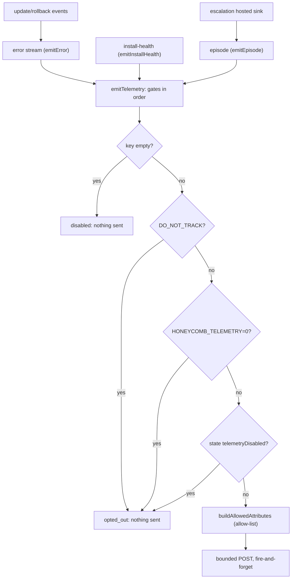

# Outbound Telemetry And Privacy

> Category: Telemetry | Version: 1.0 | Date: July 2026 | Status: Active | Author: Mario Aldayuz

For engineers touching `src/telemetry/emit.ts`, `capture.ts`, `otlp-serializer.ts`, or `device-id.ts`: this is the single egress chokepoint doctor phones home through, the allow-list that makes leaking a secret structurally impossible, the layered opt-out gates, and the shared per-install device id.

**Related:**
- [telemetry-ingestion-pipeline.md](./telemetry-ingestion-pipeline.md)
- [sse-producer.md](./sse-producer.md)
- [../operations/auto-update-engine.md](../operations/auto-update-engine.md)
- [../operations/escalation-and-needs-attention.md](../operations/escalation-and-needs-attention.md)
- [../security/trust-boundaries.md](../security/trust-boundaries.md)
- [../infrastructure/build-and-release.md](../infrastructure/build-and-release.md)
---

## Two directions, do not confuse them

Doctor's inbound telemetry (polling services' SQLite, streaming to hive) is a separate story, in [telemetry-ingestion-pipeline.md](./telemetry-ingestion-pipeline.md) and [sse-producer.md](./sse-producer.md). This doc is about the other direction: the scrubbed operational data doctor phones home about its own health, so a broken install gets noticed before a ticket is filed. That outbound data is opt-out by default and structurally incapable of carrying a secret, and the mechanism that guarantees both is a single chokepoint.

## One chokepoint, verifiable in one place

`emitTelemetry` in `src/telemetry/emit.ts` is the only function that posts to the PostHog OTLP Logs endpoint. Three streams flow through it: errors (severity ERROR), install-health snapshots (severity INFO), and remediation episodes (severity INFO or WARN sourced from `incidents.ndjson`). All three flow through this one function so the opt-out is verifiable in a single place. The transport is OTLP/HTTP+JSON at `{host}/i/v1/logs`, POSTed via the global `fetch`, with the envelope hand-rolled (no OpenTelemetry SDK, design principle 1).



Both the escalation hosted sink and the auto-update outcome events ride the same chokepoint and the same gates, so there is no second egress path to audit. A second capture path (`capture.ts`) exists for lifecycle events; it shares the same key, host, gates, and fail-soft posture, and is covered below.

## The four gates, in order

`emitTelemetry` applies four gates before it builds anything, and any hit means nothing leaves the box:

1. **Empty key.** `POSTHOG_KEY` is build-injected via esbuild `define`; an un-keyed local or fork build compiles it to the empty string, which is hard-disabled. Nothing an ordinary developer runs can emit.
2. **`DO_NOT_TRACK`.** The cross-tool standard: any value other than empty or `"0"` opts out.
3. **`HONEYCOMB_TELEMETRY=0`.** The Honeycomb-wide convention.
4. **`state.json telemetryDisabled: true`.** The finer dashboard toggle, passed as `stateTelemetryDisabled`.

`isOptedOut` implements gates 2 and 3 and mirrors the daemon's own chokepoint so the two agree on one env contract. Because all three streams pass through this one function, the opt-out is not a promise scattered across the codebase; it is one enforcement point a reviewer can read in full.

## The allow-list makes leaking impossible

The scrub is not a redaction pass that strips known-bad fields; it is a positive allow-list, so a secret is not scrubbed out so much as impossible to include. `buildAllowedAttributes` keeps only string-valued keys that appear in `ALLOWED_ATTRIBUTE_KEYS`, and drops everything else:

```typescript
export const ALLOWED_ATTRIBUTE_KEYS = [
	"stream", "device_id", "service.name", "doctor_version", "daemon_version",
	"os", "arch", "health", "trigger", "resolved", "step_count",
	"step_outcomes", "last_heal_age_s", "error_class", "error_detail", "severity_hint",
] as const;
```

Adding a new telemetry field means adding a key here first; there is no other egress path. `BANNED_ATTRIBUTE_KEYS` (token, bearer, authorization, email, path, repo, query, content, prompt, secret, credentials, stack, and more) is the negative enumeration a `payload-no-pii` test asserts absent from every serialized payload. Non-string values are dropped outright, so no object or array can smuggle nested content past the flat allow-list.

The payload is operational facts only: which stream fired, the per-install device id, coarse OS/arch (never a hostname), version strings, the incident trigger and per-step outcomes as a `"rung:outcome"` fact list (never step content), and a bucketed heal age. That last field is deliberately coarse: `bucketHealAge` maps a heal age to `"never" | "lt5m" | "lt1h" | "lt1d" | "gt1d"` so an exact interval (which could fingerprint an install's cadence) never leaves.

## Token hygiene and the wire format

The PostHog project key (`phc_...`) is a public write-only ingest key, embedded in the shipped tarball by design. It is sent in the `Authorization: Bearer` header, never a query param, so it never lands in an intermediary access log, and it is not logged anywhere in the module. The OTLP envelope is hand-rolled in `src/telemetry/otlp-serializer.ts`: pure serialization helpers with no side effects (`buildLogRecord`, `buildLogsData`, `serializeLogsData`, and the `toAnyValue` wrapper that coerces any non-primitive to a string so an object can never leak into the wire payload). Timestamps go out as OTLP nanosecond strings via `msToNanoString`, which uses `BigInt` to avoid float precision loss past 2^53.

## Fire-and-forget, fail-soft

`postOtlpLogs` is the only function in the module that touches the network. It wraps the POST in an `AbortController` timeout (`DEFAULT_EMIT_TIMEOUT_MS`, 2 seconds) and a try/catch that swallows every error. `emitTelemetry` resolves an `EmitOutcome` (`{ sent, skipped? }`) but never rejects and never throws into the calling healing loop. A telemetry failure is a warn log (`telemetry.send_failed`), never a wedge. This is the property that lets the supervisor's error seam and the escalation hook emit fire-and-forget without any risk to control flow.

## The lifecycle capture events

`src/telemetry/capture.ts` is the second egress path, for three lifecycle moments that are events rather than logs: `doctor_installed` (once per machine), `doctor_updated` (once per target version), and `doctor_uninstalled` (fire-and-forget). PostHog capture events land at `{host}/i/v0/e/`, the same endpoint honeycomb's own install funnel uses, so doctor's lifecycle correlates with the operator install funnel. The capture path shares everything that matters with the log chokepoint: the same build-injected key and host, the same four gates in the same order (`captureGate`), the same 2-second bounded POST, and the same fail-soft posture. Its payload is a separate closed allow-list (`CAPTURE_ALLOWED_PROPERTY_KEYS`: package, version, os, arch, node, from_version, to_version, outcome) built from typed inputs only, with no free-form property bag, so a path or hostname is not representable.

The `distinct_id` for capture events prefers the shared installer id at `~/.honeycomb/install-id` (written by the honeycomb install script), falling back to doctor's device id, so the lifecycle funnel joins the operator install funnel. Dedupe markers (`installedEventReported`, `updatedEventReportedVersion`) live in doctor's state store, and each marker persists only on a 2xx, so a dropped send retries on the next trigger rather than being lost.

## The shared device id

Every emitted record carries a `device_id` so installs are told apart. `resolveDeviceId` in `src/device-id.ts` is the convergence point that makes doctor and the daemon report the same id: it reads `~/.honeycomb/device.json`, and if that file carries a valid `device_id`, uses it; otherwise it mints a fresh UUID and best-effort persists it in the daemon's exact `{ device_id, label, createdAt }` shape so the next daemon boot reads doctor's file instead of minting a competing id. It never throws: an unwritable directory returns the freshly-minted id un-persisted, because a telemetry id is never worth crashing the watchdog for. The `device_id` is scrubbed like everything else, an allow-listed correlation key, never a secret.

## How the build injects the key

The key and host reach the binary through esbuild `define` at build time (`__HONEYCOMB_POSTHOG_KEY__`, `__HONEYCOMB_POSTHOG_HOST__`). An unset key compiles to the empty string, which gate 1 treats as hard-disabled, so a local or fork build emits nothing. The key is public and write-only; the CI secret only keeps it out of logs and fork PRs, and no real key is ever committed to source. The full release-side story is in [../infrastructure/build-and-release.md](../infrastructure/build-and-release.md).

## Invariants for contributors

- Every outbound field goes through the positive allow-list. A new attribute is added to `ALLOWED_ATTRIBUTE_KEYS` first, or it cannot leave.
- All three log streams stay behind `emitTelemetry`, and the lifecycle events stay behind `captureGate`. No new code path posts to PostHog directly.
- The four gates stay in order and identical between `emit.ts` and `capture.ts`. The opt-out is one contract.
- Emits stay fire-and-forget and fail-soft. A telemetry failure is a warn log, never a throw into a caller.
- Coarse facts only: bucketed ages, coarse OS/arch, no hostnames, no exact timestamps beyond the record time.
- The key stays a public write-only ingest key sent in the Bearer header, never a query param, never logged.
