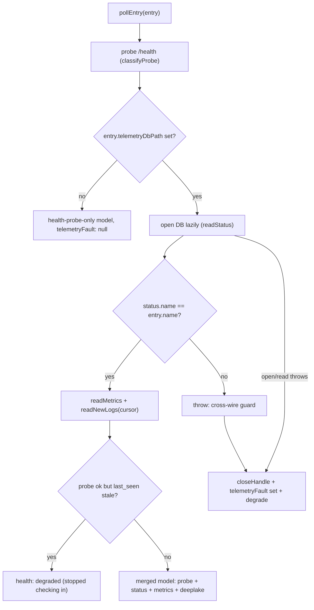

# Telemetry Ingestion Pipeline

> Category: Telemetry | Version: 1.0 | Date: July 2026 | Status: Active | Author: Mario Aldayuz

For engineers working on `src/ingestion/poll-loop.ts` or `src/telemetry/sqlite-reader.ts`: this is the poll-and-merge loop internals, the read-only SQLite reader's windowed queries, the per-service fault isolation, and the model types that flow out to the SSE producer.

**Related:**
- [sse-producer.md](./sse-producer.md)
- [outbound-telemetry-and-privacy.md](./outbound-telemetry-and-privacy.md)
- [../architecture/telemetry-single-source-of-truth.md](../architecture/telemetry-single-source-of-truth.md)
- [../architecture/health-probe-classification.md](../architecture/health-probe-classification.md)
- [../data/registry-and-state.md](../data/registry-and-state.md)
- [../security/trust-boundaries.md](../security/trust-boundaries.md)
---

## Where this fits

[telemetry-single-source-of-truth.md](../architecture/telemetry-single-source-of-truth.md) explains the ADR-0001/0002 pipeline and the three pinned contracts at the level of what and why. This doc is the how: the internals of the puller half of ADR-0001. About once per second, for every registered service, the poll loop probes `/health` and, when the entry carries a `telemetryDbPath`, opens that service's SQLite database read-only and runs windowed queries, merging both into one in-memory `FleetTelemetryEvent`. That event is the single source of truth the SSE producer streams to hive.

## The model types

`src/telemetry/schema.ts` defines the shapes the loop parses and emits. Doctor is a reader only: it never creates or writes any telemetry table. The row shapes it parses out of a service's read-only handle:

```typescript
export interface ServiceStatusRow {
	readonly name: string;
	readonly bindingTime: string;
	readonly lastSeen: string;
	readonly health: string;
	readonly deeplakeConnected: boolean | null;
	readonly deeplakeLastComm: string | null;
}
export type ServiceMetrics = Readonly<Record<string, number>>;
```

`ServiceMetrics` is deliberately not a fixed shape: honeycomb ships three counters, nectar five, on the same `service_metrics` table name, so the reader forwards every column except the bookkeeping `id`/`updated_at`, camelCased. The fleet-wide model the loop produces:

```typescript
export interface FleetServiceModel {
	readonly name: string;
	readonly health: FleetHealth;                       // "ok" | "degraded" | "unreachable" | "unknown"
	readonly lastSeen: string | null;
	readonly metrics: ServiceMetrics;
	readonly deeplake: FleetDeeplakeStats | null;
	readonly telemetryFault: TelemetryFaultReason | null;
}
export interface FleetTelemetryEvent {
	readonly asOf: string;
	readonly services: readonly FleetServiceModel[];
	readonly logs: readonly FleetLogEntry[];
}
```

`telemetryFault` is the field that goes non-null when a service's DB was skipped this tick (`"missing" | "locked" | "malformed" | "read-error"`), the isolation signal at the heart of this doc.

## The read-only SQLite reader

`openTelemetryDb` in `src/telemetry/sqlite-reader.ts` opens one service's database with `node:sqlite`'s `DatabaseSync`, the same built-in honeycomb already relies on, strictly read-only:

```typescript
const db = new DatabaseSync(path, { readOnly: true, timeout: BUSY_TIMEOUT_MS });
```

The `readOnly: true` flag is doctor's structural guarantee that it never writes another process's telemetry database; the 1-second `BUSY_TIMEOUT_MS` is a safety net for the rare WAL-mode read/write contention. The reader exposes exactly three queries, and every one is memory-bounded:

- **`readStatus()`** is a single-row `SELECT * FROM service_status WHERE id = 1 LIMIT 1`. `parseStatusRow` is tolerant: a row missing any required text column (`name`/`binding_time`/`last_seen`/`health`) degrades to `null` ("no usable status", which becomes `unknown` upstream) rather than throwing over one soft field.
- **`readMetrics()`** is a single-row `SELECT * FROM service_metrics WHERE id = 1 LIMIT 1`. `parseMetricsRow` forwards every column except `id`/`updated_at`, camelCased and coerced to a finite number. This is the schema-tolerance that lets honeycomb's 3-counter and nectar's 5-counter variants both work with zero doctor code changes.
- **`readNewLogs(sinceId, limit)`** is the windowed cursor read: `SELECT id, ts, level, message FROM service_logs WHERE id > ? ORDER BY id ASC LIMIT ?`. It reads only rows past the caller's cursor, bounded to `limit`, and returns the highest `id` seen so the next call advances and never re-reads. This is what keeps memory bounded regardless of a service's total log history.

`close()` is idempotent and never throws. A missing file, a lock held past the busy timeout, or a database that is not valid SQLite throws out of the relevant method, and the poll loop catches it per service.

## The poll loop's per-entry runtime

`createPollLoop` in `src/ingestion/poll-loop.ts` carries state across ticks per entry, in an `EntryRuntime`:

```typescript
interface EntryRuntime {
	db: TelemetryDbReader | null;   // the open handle, reopened lazily
	lastLogId: number;              // the windowed-read cursor
	lastKnownStatus: ServiceStatusRow | null; // for graceful degradation on a fault
	lastKnownMetrics: ServiceMetrics;
}
```

The handle is opened lazily (only when null) and the cursor persists so logs are never re-read. The last-known status and metrics are what a faulted service degrades to, rather than vanishing from the model.

## Polling one entry

`pollEntry` is where a single service's probe and SQLite reads merge. It never throws:



The health merge (`FleetHealth`) folds three signals into one per service: a probe `unreachable` wins outright, then probe `degraded`, then a probe `ok` with a stale `last_seen` (older than `staleAfterMs`, default 3x the entry's own `probeIntervalMs`) reports `degraded` rather than a stale `ok`, because the service answers HTTP but stopped checking in to its own telemetry. A registered-but-silent service (`status === null`) reports `unknown`. A disconnect is never a deletion: the static entry stays and `lastSeen` simply stops advancing (ADR-0002 decision 3), which is itself the recorded disconnect signal.

## The cross-wire guard

One check inside `pollEntry` is a security control, not a convenience. `ServiceStatusRow.name` is the contract key back to the registry entry, so a database whose own recorded name does not match the entry doctor opened it for is treated as malformed and rejected before any row is cached or forwarded:

```typescript
if (status !== null && status.name !== entry.name) {
	throw new Error(
		`malformed telemetry db: service_status.name "${status.name}" does not match registry entry "${entry.name}"`,
	);
}
```

Throwing here routes into the fault-isolation path below, so a mispointed `telemetryDbPath` can never cross-wire one service's status, metrics, or logs onto another. This is the second layer of the `telemetryDbPath` defense; the first is the path-containment coercion at registry-parse time (see [../security/trust-boundaries.md](../security/trust-boundaries.md)).

## Fault isolation

The whole point of `pollEntry`'s per-entry try/catch is that one bad database is isolated to that one service. On any SQLite fault (missing, locked, malformed, or the cross-wire guard firing), `pollEntry`:

1. closes and drops the handle, so the next tick retries opening fresh and can recover from a transient lock or a rewritten file,
2. classifies the fault (`classifyDbFault` heuristically maps the error message to `missing`/`locked`/`malformed`/`read-error`; the isolation itself does not depend on getting this exactly right),
3. degrades that service to its probe-only signal plus its last-known telemetry, with `telemetryFault` set,
4. logs `poll-loop.telemetry_db_fault`.

Every other service keeps polling normally. `runTick` calls `pollEntry` for every entry through `Promise.all`, which is safe precisely because `pollEntry` never rejects.

## The tick and the subscriber fan-out

`runTick` builds one `FleetTelemetryEvent` per cycle, stamps it into `latest`, and fans it out to every subscriber:

```typescript
for (const listener of listeners) {
	try {
		listener(event);
	} catch (error) {
		logger.warn("poll-loop.listener_threw", { ... });
	}
}
```

A misbehaving subscriber (one SSE consumer's write path) is caught so it can never affect the loop or another subscriber. The SSE producer subscribes through `onSnapshot`; that fan-out is the seam between this loop and [sse-producer.md](./sse-producer.md).

## reload() and close()

`reload(nextEntries)` replaces the polled set without rebuilding the loop, on boot, restart, or an explicit (de)registration. It evicts runtime state for daemons no longer present, and, crucially, for a same-name daemon whose `telemetryDbPath` changed or disappeared: keeping the old runtime would keep reading the old file (the handle is only reopened when null), and its stale `lastLogId` could skip the start of the new DB entirely. Dropping the runtime closes the old handle and resets the cursor so the next tick reopens fresh.

`close()` closes every held handle without changing the polled set, the clean-shutdown hook the composition root calls in `stop()` so a stopped watchdog never holds a service's database file open.

## Boundaries with supervision

The telemetry pipeline and the supervision pipeline share the registry and nothing else. A telemetry fault never influences a restart or escalation decision, and a remediation in flight never blocks a poll tick. The two loops start and stop independently. This isolation is what lets doctor be authoritative about fleet telemetry without letting a bad service database wedge the watchdog.

## Invariants for contributors

- Every SQLite read is a single-row `id = 1` lookup or a windowed `id > ? LIMIT ?` scan. No unbounded read enters the loop.
- The reader stays read-only. `DatabaseSync(..., { readOnly: true })` is doctor's structural write-guarantee.
- The metrics reader stays schema-tolerant. It excludes bookkeeping columns, never hardcodes a counter list.
- The cross-wire guard stays: a `service_status.name` mismatch is treated as malformed before any row is cached.
- `pollEntry` never throws. A new read path routes its failure through the per-entry isolation.
- `reload` drops runtime for a changed or removed `telemetryDbPath` so the loop never reads a stale file.
